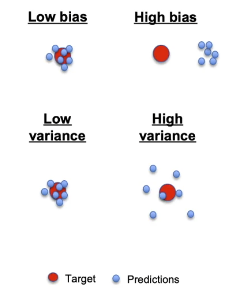
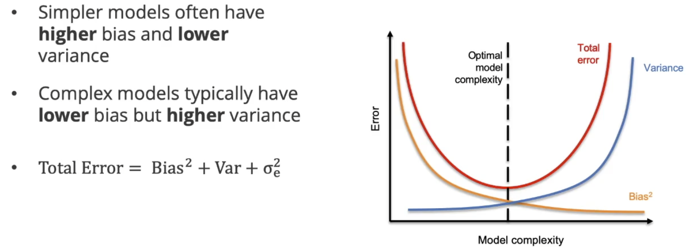
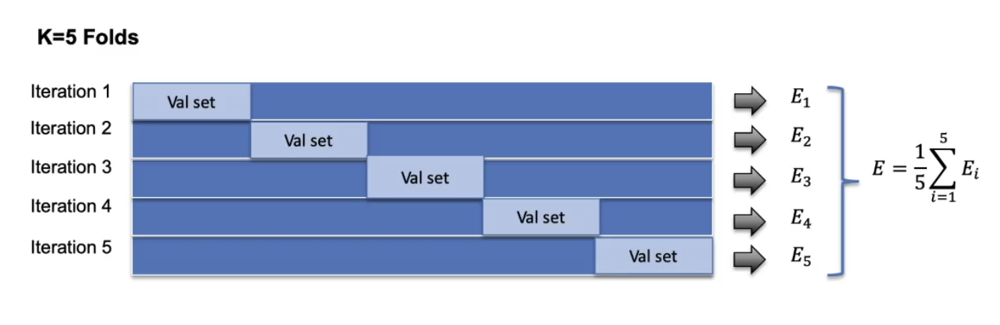

# Module 2)모델링 프로세스 

이번 모듈에서는 머신러닝 모델을 실제로 개발하고 훈련시키는 전체적인 프로세스를 다룰 예정입니다. 만드는 법뿐만 아니라, 모델을 만들 때 마주하게 되는 난제들과 이를 극복하기 위한 평가 전략들을 배웁니다.

이번 모듈의 핵심 학습 목표:

| 학습 목표 | 상세 내용 | 비고 |
| :--- | :--- | :--- |
| **개발 단계 기술** | 머신러닝 모델을 개발하기 위한 각 단계(Step)를 순서대로 설명할 수 있음. | 프로세스 이해 |
| **편향-분산 트레이드오프** | 머신러닝이 왜 어려운지, 그 핵심인 **편향-분산 트레이드오프($Bias-Variance\ Tradeoff$)**의 개념을 이해함. | 난이도의 원인 |
| **데이터 누수 식별** | 모델 성능을 왜곡하는 **데이터 누수($Data\ Leakage$)**의 원인을 찾고 이해함. | 품질 관리 |
| **예방 전략 수립** | 모델링 과정에서 데이터 누수를 방지하기 위한 실질적인 전략을 수립함. | 실무 적용 |

주요 키워드:

* **모델 선택 (Model Selection):** 수많은 알고리즘 중 우리 문제에 가장 적합한 것을 고르는 과정.
* **편향-분산 트레이드오프 ($Bias-Variance, \ Tradeoff$):** 모델이 너무 단순해서 학습을 못 하거나(High Bias), 너무 복잡해서 과하게 학습하는(High Variance) 사이의 균형점.
* **데이터 누수 ($Data\ Leakage$):** 학습 데이터에 미래의 정보나 정답이 미리 섞여 들어가서 모델의 성능이 가짜로 높게 나오는 현상.

---

## 📝 모델 구축 프로세스: CRISP-DM과 반복적 학습 (The Modeling Process)

모델을 만드는 과정은 단순히 코드를 짜는 것에 그치지 않습니다. 데이터 과학의 표준 프로세스인 **CRISP-DM**의 맥락 안에서 모델이 어떻게 탄생하고 진화하는지 이해하는 것이 중요합니다.

---

### 1. 데이터 사이언스 표준 프로세스: CRISP-DM

**CRISP-DM** (Cross-Industry Standard Process for Data Mining)은 산업 전반에서 통용되는 데이터 해결 방식입니다. 총 6단계로 구성되며, 모델링은 그중 네 번째 단계에 해당합니다.

| 단계 | 명칭 | 핵심 활동 |
| :--- | :--- | :--- |
| **Step 1** | **비즈니스 이해 (Business Understanding)** | 해결하려는 문제 정의, 성공의 기준 및 측정 방법 결정 |
| **Step 2** | **데이터 이해 (Data Understanding)** | 필요한 데이터 식별, 수집 및 초기 분석 |
| **Step 3** | **데이터 준비 (Data Preparation)** | 모델링을 위한 데이터 정제 및 가공 |
| **Step 4** | **모델링 (Modeling)** | 알고리즘 선택, 하이퍼파라미터 튜닝 및 모델 구축 |
| **Step 5** | **평가 (Evaluation)** | 모델이 비즈니스 목적에 부합하는지 성능 검증 |
| **Step 6** | **배포 (Deployment)** | 최종 모델을 실제 환경에 적용 |

> **중요:** 모든 과정의 출발점인 **Step 1(비즈니스 이해)**이 가장 중요합니다. 문제가 무엇인지, 성공이 무엇인지 모른다면 아무리 좋은 데이터를 모아도 좋은 모델을 만들 수 없습니다.

---

### 2. 모델 학습(Training)의 수학적 본질

모델 학습이란 데이터 사이의 **최적의 관계식**을 찾아가는 과정입니다.

* **방정식의 형태:** 모델은 입력($x$)과 출력($y$)의 관계를 나타내는 하나 이상의 방정식으로 표현됩니다.
* **학습의 의미:** 우리가 '모델을 훈련시킨다'고 할 때, 실제로는 방정식 내의 **최적의 계수(Coefficient)값**을 찾아내는 과정을 말합니다.
* **예시 (부동산):**
    * **입력($x$):** 방 개수, 면적 등 (과거 관측치)
    * **출력($y$):** 실제 판매 가격 (타겟)
    * **학습 결과:** 새로운 집의 면적을 넣었을 때 예상 가격을 뱉어내는 '최적화된 방정식' 완성.

---

### 3. 모델 구축의 4대 구성 요소 재점검

모델링 단계(Step 4)에서는 이전 레슨에서 배웠던 4가지 요소가 유기적으로 작동합니다.

| 구성 요소 | 단계 내 역할 | 상세 설명 |
| :--- | :--- | :--- |
| **특성 선택 (Features)** | 데이터 준비 단계의 연장선 | 어떤 데이터(예: 면적, 학군)가 가격 예측에 가장 큰 영향을 주는지 결정 (**Feature Engineering**) |
| **알고리즘 (Algorithm)** | 모델의 템플릿 선정 | 입력과 출력을 연결할 방정식의 '기본 틀' 선택 (예: 선형 회귀, 의사결정 나무 등) |
| **하이퍼파라미터** | 성능 조절 노브 (Dials) | 모델의 복잡도를 미세하게 조정하여 성능을 최적화하는 설정값 |
| **손실 함수 (Loss)** | 성능 평가 지표 | 모델이 잘 가고 있는지, 아니면 나빠지고 있는지 알려주는 '나침반' 역할 |

---

### 4. 반복적 프로세스 (Iterative Process)

모델링은 한 번에 끝나는 선형적 과정이 아니라, 끊임없이 되돌아가는 **반복(Iteration)**의 과정입니다.

1.  데이터 수집 및 특성 선택
2.  알고리즘 선정 및 하이퍼파라미터 설정
3.  과거 데이터로 모델 훈련
4.  **손실 함수를 통한 성능 평가**
5.  **성능이 불만족스러울 경우:** Step 1~3으로 돌아가 특성을 바꾸거나, 알고리즘을 변경하거나, 하이퍼파라미터를 재조정합니다.
6.  만족스러운 결과가 나올 때까지 이 루프를 반복합니다.

---

### 핵심 요약 (Key Takeaways)

1.  **비즈니스 우선:** 모델링 이전에 '우리가 해결하려는 문제'에 대한 명확한 이해가 선행되어야 합니다.
2.  **학습은 계수 찾기:** 모델 훈련은 데이터 간의 관계를 정의하는 방정식의 최적 계수를 찾는 행위입니다.
3.  **순환 구조:** 머신러닝은 한 번에 완성되지 않습니다. 평가 결과에 따라 특성 공학부터 하이퍼파라미터 튜닝까지 수없이 반복하는 과정이 본질입니다.

## 📝 특성 선택 (Feature Selection)

모델 구축 프로세스에서 가장 중요한 단계를 꼽으라면 단연 **특성 선택(Feature Selection)**입니다. 어떤 데이터를 학습시키느냐에 따라 모델의 성패가 갈리기 때문입니다.

---

### 1. 특성(Feature)이란 무엇인가?

특성은 우리가 해결하려는 문제의 **데이터가 가진 특성이나 항목**들을 말합니다.

* **예시 (부동산):** 침실 수, 화장실 수, 동네(Neighborhood), 학군, 건축 연도 등.
* **특성 선택의 목표:** 입력값($x$) 중 타겟($y$, 예: 집값)을 가장 정확하게 예측하는 데 도움이 되는 핵심 항목들을 찾아내는 것.

---

### 2. 좋은 특성을 정의하는 2가지 기준

학습에 사용할 특성은 단순히 많다고 좋은 것이 아니라, 다음 두 영역의 **교집합**에서 찾아야 합니다.

1.  **영향 요인 (Influencing Factors):** 문제의 결과에 실제로 영향을 줄 수 있는 요소인가?
2.  **데이터 가용성 (Data Availability):** 우리가 실제로 수집하고 측정할 수 있는 데이터인가?

---

### 3. [사례 연구] 전력 정전 예측 모델 (Power Outage Predictor)

교수님이 리드했던 팀의 실제 사례를 통해 특성 선택의 중요성을 확인할 수 있습니다.

* **목표:** 폭풍 전, 정전의 심각성과 위치를 미리 예측.
* **발견한 핵심 특성:**
    * **기상 데이터:** 풍속(Wind Gust), 강수량 등.
    * **의외의 요소 - 계절성(Seasonality):** 나무에 **잎**이 달려 있는 시기에는 바람의 저항을 더 많이 받아 전선 위로 쓰러질 확률이 훨씬 높음. (전문가 인터뷰를 통해 발견)

---

### 4. 특성 선택의 4가지 주요 방법

| 방법 | 설명 | 비고 |
| :--- | :--- | :--- |
| **전문가 인터뷰** | 해당 산업의 전문가(도메인 전문가)에게 직접 묻기 | **가장 추천하는 방법** |
| **데이터 시각화** | 산점도(Plot) 등을 그려 입력 특성과 출력 사이의 관계 확인 | 직관적인 관계 파악 |
| **통계적 테스트** | 상관관계(Correlation) 등 통계 지표로 관계의 강도 측정 | 수치적 근거 확보 |
| **모델 기반 기법** | 모델을 직접 훈련시켜보며 중요도가 낮은 특성을 제거 | 실전 성능 기반 |

---

### 5. 전문가의 팁 (Pro Tip)

> **"특성이 너무 적은 것이 너무 많은 것보다 훨씬 위험하다."**

* **전략:** 처음에는 의심되는 모든 요소를 포함

## 📝 알고리즘 선택 (Algorithm Selection)

특성 선택이 완료되었다면, 이제 입력($x$)과 출력($y$) 사이의 관계를 정의할 **템플릿**인 알고리즘을 선택해야 합니다.

---

### 1. 알고리즘의 두 가지 주요 유형

머신러닝 알고리즘은 수학적 구조에 따라 크게 두 가지로 분류됩니다.

| 유형 | 정의 | 특징 | 대표 예시 |
| :--- | :--- | :--- | :--- |
| **파라미터 알고리즘 (Parametric)** | 입출력 관계를 명확한 수학적 방정식으로 정의함 | 학습의 목표는 방정식의 **계수(Coefficient)**를 찾는 것 | 선형 회귀 (Linear Regression) |
| **비파라미터 알고리즘 (Non-parametric)** | 단일 방정식으로 정의되지 않는 유연한 구조 | 데이터의 형태에 따라 구조가 결정됨 | 의사결정 나무 (Decision Tree) |

---

### 2. "공짜 점심은 없다" (No Free Lunch Theorem)

머신러닝 세계의 아주 중요한 법칙입니다. **모든 문제에 만능인 단 하나의 알고리즘은 존재하지 않는다**는 정리입니다.

* **최적의 선택:** 내가 가진 데이터의 특성, 해결하려는 문제의 성격에 따라 최적의 알고리즘은 매번 달라집니다.
* **실무적 접근:** 따라서 보통은 여러 개의 알고리즘을 시도해 보고, 그 성능을 비교하여 가장 결과가 좋은 것을 선택하는 방식을 취합니다.

---

### 3. 알고리즘 선택의 3대 기준

단순히 "정확도"만 봐서는 안 됩니다. 실무에서는 다음 세 가지 요소의 **균형(Balance)**이 중요합니다.

1.  **성능/정확도 (Performance/Accuracy):** 모델이 얼마나 정확하게 예측하는가? (가장 기본적인 기준)
2.  **해석 가능성 (Interpretability):** 모델이 왜 그런 예측을 내놓았는지 사람이 이해하고 설명할 수 있는가?
    * **높음:** 선형 회귀, 의사결정 나무 (고객에게 설명하기 쉬움)
    * **낮음:** 신경망/딥러닝 (복잡한 수식 덩어리라 설명이 매우 어려움)
3.  **연산 효율성 (Computational Efficiency):** 훈련 및 예측에 얼마나 많은 컴퓨터 자원(시간, CPU/GPU)이 필요한가?
    * 단순한 모델은 빠르고 가볍지만, 복잡한 모델(신경망 등)은 훈련에 며칠, 몇 주가 걸릴

## 📝 모델의 복잡도와 편향-분산 트레이드오프 (Bias-Variance Tradeoff)

머신러닝 모델링에서 가장 어려운 과제 중 하나는 주어진 문제에 맞는 **적절한 복잡도(Complexity)**를 찾는 것입니다. 모델이 너무 단순해서도, 너무 복잡해서도 안 되기 때문입니다.

---

### 1. 모델 복잡도를 결정하는 3가지 요소

모델의 복잡도는 다음 세 가지의 선택 결과로 나타납니다.

1.  **특성의 수 (Number of Features):** 포함하는 특성이 많아질수록 모델은 복잡해집니다.
2.  **알고리즘 선택 (Algorithm Selection):** 선형 회귀 같은 단순한 알고리즘인지, 신경망(Neural Networks) 같은 복잡한 알고리즘인지에 따라 결정됩니다.
3.  **하이퍼파라미터 (Hyperparameters):** 알고리즘의 세부 설정을 조절하는 '노브(Knobs)'를 어떻게 맞추느냐에 따라 모델의 복잡도가 달라집니다.

---

### 2. 편향(Bias)과 분산(Variance)의 정의

모델의 오차는 크게 두 가지 성분으로 나뉩니다.

* **편향 (Bias):** 복잡한 현실 문제를 너무 단순한 모델로 설명하려 할 때 발생하는 오차입니다. 데이터의 내재된 패턴을 제대로 포착하지 못해 **정답에서 지속적으로 벗어나는 현상**을 보입니다.
* **분산 (Variance):** 모델이 학습 데이터의 작은 변동(노이즈)에 얼마나 민감하게 반응하는지를 나타냅니다. 분산이 높으면 학습 데이터에 너무 딱 맞춰져서, **데이터가 조금만 바뀌어도 예측값이 크게 요동**칩니다.

---

### 3. 전체 오차 (Total Error) 공식

모델의 전체 오차는 수학적으로 다음과 같이 정의됩니다.

$$Total\ Error = Bias^2 + Variance + Irreducible\ Error$$

* **가산 오차 (Irreducible Error):** 어떤 모델로도 해결할 수 없는 데이터 자체의 무작위 노이즈를 의미합니다.

---

### 4. 과소적합(Underfitting) vs 과적합(Overfitting)

모델의 복잡도에 따라 우리가 직면하게 되는 두 가지 극단적인 상황입니다.

| 구분 | 과소적합 (Underfitting) | 과적합 (Overfitting) |
| :--- | :--- | :--- |
| **상태** | 모델이 너무 단순함 | 모델이 너무 복잡함 |
| **특징** | 고편향(High Bias), 저분산(Low Variance) | 저편향(Low Bias), 고분산(High Variance) |
| **원인** | 패턴을 포착하지 못함 | 데이터의 노이즈까지 학습해버림 |
| **결과** | 학습 데이터와 새 데이터 모두에서 성능 저하 | 학습 데이터에만 완벽하고 새 데이터에선 망함 |

---

### 5. 편향-분산 트레이드오프 (The Tradeoff)

모델이 복잡해질수록 편향은 줄어들지만 분산은 늘어납니다. 반대로 모델이 단순해지면 분산은 줄어들지만 편향이 늘어납니다.

* **우리의 목표:** 편향과 분산의 합($Total\ Error$)이 **최소화되는 최적의 복잡도 지점**을 찾는 것입니다.
* **그래프 해석:** * **왼쪽 (Underfitting):** 모델이 너무 직선적이라 곡선 패턴을 못 읽음.
    * **가운데 (Optimal):** 패턴은 유지하면서 노이즈는 무시함.
    * **오른쪽 (Overfitting):** 모든 점을 통과하려고 구불구불해져서 새로운 데이터가 오면 예측이 엉망이 됨.

---

### 💡 핵심 요약 (Key Takeaways)

1.  **균형의 예술:** 머신러닝은 결국 편향과 분산 사이의 황금 밸런스를 찾는 과정입니다.
2.  **노이즈 주의:** 모델이 학습 데이터의 점 하나하나에 집착하기 시작하면(Overfitting), 실전(New Data)에서는 쓸모없는 모델이 됩니다.
3.  **최적 지점:** 전체 오차가 가장 낮은 지점의 복잡도를 선택하는 것이 모델링의 핵심입니다.

## 📝 테스트 Set과 평가 Set (Evaluating Performance & Data Splitting)

머신러닝의 궁극적인 목표는 과거의 데이터를 외우는 것이 아니라, **'처음 보는 새로운 데이터(Unseen Data)'에 대해 정확한 예측을 내리는 것**입니다. 이를 위해 모델의 성능을 제대로 평가하고 검증하는 전략이 필수적입니다.

---

### 1. 모델 성능을 평가하는 두 가지 시점

평가는 모델링 과정에서 두 번에 걸쳐 이루어집니다.

1.  **학습 과정 중의 평가:** 알고리즘을 변경하거나 하이퍼파라미터(노브)를 조절할 때, 모델이 개선되고 있는지 악화되고 있는지 방향성을 확인하기 위해 평가합니다.
2.  **최종 평가:** 모델 구축이 완전히 끝난 후, 모델이 학습 과정에서 단 한 번도 본 적 없는 **새로운 데이터**를 사용하여 실전 예측 능력을 검증합니다.

---

### 2. 기본 데이터 분할 (Train vs. Test)

미래의 데이터를 미리 가져올 수는 없으므로, 우리가 가진 전체 데이터를 두 그룹으로 나누어 시뮬레이션합니다.

* **훈련 세트 (Training Set, 80~90%):** 모델을 구축하고 학습시키는 데 사용하는 데이터.
* **테스트 세트 (Test Set, 10~20%):** 최종 모델의 실전 성능을 평가하기 위해 끝까지 숨겨두는 데이터.

---

### 3. 치명적인 실수: 데이터 누수 (Data Leakage)

머신러닝 모델링 중 가장 흔하면서도 치명적인 실수가 바로 **데이터 누수(Data Leakage)**입니다.

* **정의:** 최종 평가를 위해 숨겨두어야 할 **테스트 세트의 정보가 모델 학습이나 특성 선택 과정에 실수로 섞여 들어가는 현상**입니다. (마치 학생이 시험지를 미리 훔쳐보고 시험을 치는 것과 같습니다.)
* **발생 예시:** 전체 데이터를 사용해 특성 선택(Feature Selection)을 먼저 해버린 후 훈련/테스트 세트로 나누는 경우.
* **결과 (과대평가):** 테스트 세트에서의 성능이 비정상적으로 높게(Overoptimistic) 나옵니다. 하지만 이 모델을 실제 서비스에 배포하면 성능이 처참하게 무너집니다.

---

### 4. 완벽한 검증을 위한 3단 분할 (Train / Validation / Test)

여러 알고리즘을 비교하거나 하이퍼파라미터를 튜닝할 때 테스트 세트를 사용해버리면, 테스트 세트는 더 이상 오염되지 않은 '새로운 데이터'가 아니게 됩니다. 이를 방지하기 위해 훈련 데이터를 한 번 더 쪼갭니다.

| 데이터 세트 | 비율 | 목적 및 역할 |
| :--- | :--- | :--- |
| **훈련 세트 (Training)** | 60~80% | 여러 가지 초기 모델을 학습시키는 메인 교재 |
| **검증 세트 (Validation)** | 10~20% | 학습된 모델들의 성능을 비교하고 최적의 알고리즘/하이퍼파라미터를 **선택(모의고사)**하는 데 사용 |
| **테스트 세트 (Test)** | 10~20% | 모든 튜닝이 끝난 최종 모델을 단 한 번 평가하는 **최종 수능 시험** |

**3단 분할 워크플로우:**
1. 훈련 세트로 여러 모델을 학습합니다.
2. 검증 세트로 성능을 비교해 최적의 모델(최종 모델)을 선택합니다.
3. (선택적) 선택된 최종 모델을 '훈련 세트 + 검증 세트'를 합친 데이터로 다시 학습시킵니다.
4. 마지막으로 **테스트 세트**를 사용해 최종 성능을 측정합니다.

---

### 💡 핵심 요약 (Key Takeaways)

1.  **목표는 일반화(Generalization):** 모델 평가는 '처음 보는 데이터'를 얼마나 잘 맞추는지 확인하는 과정입니다.
2.  **시험지 사전 유출 금지:** 테스트 세트는 모델 학습의 어떤 단계에서도 절대 사용되어서는 안 됩니다 (데이터 누수 방지).
3.  **검증(Validation)의 중요성:** 모델을 비교하고 튜닝할 때는 테스트 세트가 아닌 검증 세트를 사용해 테스트 세트의 무결성을 지켜야 합니다.

## 📝 교차 검증 (Cross-Validation)

지난 시간에는 모델 평가를 위해 데이터를 훈련, 검증, 테스트 세트로 나누는 방법을 배웠습니다. 하지만 고정된 검증 세트(Validation Set)를 사용하는 것에는 몇 가지 한계가 있습니다. 이를 극복하기 위해 실무에서 가장 선호되는 평가 전략인 **교차 검증(Cross-Validation)**에 대해 알아보겠습니다.

---

### 1. 교차 검증이란?

단일하게 고정된 검증 세트를 사용하는 대신, **데이터를 여러 번 나누어 여러 번의 평가(Iteration)를 수행하는 방식**입니다. 학습과 검증의 역할을 계속 교대시키면서 모델의 성능을 종합적으로 평가합니다.

가장 대표적인 방법은 **$K$-폴드 교차 검증 ($K$-Folds Cross-Validation)**입니다. (일반적으로 $K$값은 5 또는 10을 가장 많이 사용합니다.)

---

### 2. $K$-폴드 교차 검증의 작동 원리 (예: 5-Fold)

훈련 데이터를 5개의 조각(Fold)으로 나눈다고 가정해 보겠습니다.

| 반복 (Iteration) | 검증 세트 (Validation) | 훈련 세트 (Training) |
| :--- | :--- | :--- |
| **1회차** | Fold 1 | Fold 2, 3, 4, 5 |
| **2회차** | Fold 2 | Fold 1, 3, 4, 5 |
| **3회차** | Fold 3 | Fold 1, 2, 4, 5 |
| **4회차** | Fold 4 | Fold 1, 2, 3, 5 |
| **5회차** | Fold 5 | Fold 1, 2, 3, 4 |

1. **로테이션:** 매 반복마다 1개의 Fold를 검증용으로, 나머지 4개의 Fold를 훈련용으로 사용합니다.
2. **에러 계산:** 각 회차마다 검증 세트에서 발생한 오차(Error)를 기록합니다.
3. **최종 평가:** 5번의 반복이 모두 끝나면, 각 회차에서 얻은 **오차들의 평균(Average Error)**을 내어 최종 모델 성능으로 평가합니다.

---

### 3. 왜 실무에서는 교차 검증을 선호할까? (주요 장점)

단일 검증 세트를 사용하는 것보다 교차 검증이 훨씬 더 강력한 이유는 다음 두 가지입니다.

#### ① 훈련 데이터의 극대화 (Maximizes Training Data)
고정된 검증 세트를 쓰면, 그 데이터는 모델 학습에 영영 참여하지 못하게 됩니다. 데이터가 아주 많다면 상관없지만, **데이터가 적을 때는 치명적**입니다. 
반면 교차 검증은 검증 세트가 계속 로테이션되므로, 궁극적으로 **모든 데이터 포인트가 적어도 한 번 이상 모델 훈련에 사용**됩니다.

#### ② 더 나은 일반화성능 및 편향 감소 (Better Generalization)
우연히 검증 세트에 너무 쉽거나 너무 어려운 데이터만 쏠려 있다면(Selection Bias), 모델 성능이 과대/과소평가될 위험이 있습니다. 
교차 검증은 **모든 데이터가 한 번씩 검증에 사용**되기 때문에, 훨씬 더 넓은 범위의 데이터에서 성능을 테스트하게 되며, 특정 데이터 분할에 의해 성능 평가가 왜곡되는 것을 방지합니다.

---

### 💡 핵심 요약 (Key Takeaways)

1. **로테이션 평가:** 교차 검증은 데이터를 $K$개의 조각으로 나누어, 돌아가면서 한 번씩 모의고사를 치르는 방식입니다.
2. **데이터 효율성:** 버려지는 데이터 없이 모든 데이터를 훈련과 평가에 알뜰하게 사용할 수 있어 소규모 데이터셋에서 특히 유용합니다.
3. **신뢰할 수 있는 지표:** 우연에 기댄 평가를 방지하고, 모델이 처음 보는 데이터(새로운 데이터)에서 얼마나 잘 작동할지 가장 객관적으로 알려주는 지표입니다.

---

## 📝 모듈 2 총정리: 모델 구축 및 평가 (Module Wrap-up)

이번 모듈에서는 머신러닝 모델을 구축하는 전체 프로세스와, 완성된 모델의 성능을 제대로 평가하고 비교하는 핵심 전략들을 다루었습니다. 지금까지 배운 내용을 전체적으로 되짚어 보겠습니다.

---

### 1. 모든 것의 시작: 비즈니스 이해 (CRISP-DM Step 1)

모델링 자체는 전체 데이터 사이언스 프로세스(CRISP-DM)의 한 단계에 불과합니다. 하지만 훌륭한 모델은 항상 **1단계인 '비즈니스 이해(Business Understanding)'**에서 출발합니다.

* **문제 정의:** 우리가 정확히 어떤 문제를 풀려고 하는지 명확히 해야 합니다.
* **성능 지표(Metrics):** 무엇을 '성공'으로 볼 것인지 측정 기준을 세워야, 이후 모델을 평가할 때 올바른 방향으로 가고 있는지 판단할 수 있습니다.

---

### 2. 모델 복잡도(Complexity)와 알고리즘 선택

모델의 복잡도를 결정짓는 3가지 핵심 요소와, 모델의 뼈대가 되는 알고리즘을 선택하는 기준을 배웠습니다.

**모델 복잡도의 3대 원천:**
1. **특성(Features):** 모델에 입력으로 사용할 변수들의 수와 종류.
2. **알고리즘(Algorithm):** 입출력 관계를 정의하는 템플릿 (단순한 선형 회귀부터 복잡한 신경망까지).
3. **하이퍼파라미터(Hyperparameters):** 알고리즘의 세부 작동을 조절하는 튜닝 다이얼(Knobs).

**알고리즘 선택의 3대 기준:**
* **성능/정확도 (Performance)**
* **해석 가능성 (Interpretability)**
* **연산 비용/효율성 (Computational Cost)**

---

### 3. 복잡도의 함정: 과소적합과 과적합

주어진 데이터나 문제의 난이도에 비해 모델의 복잡도가 적절하지 않을 때 발생하는 두 가지 치명적인 문제입니다.

* **과소적합 (Underfitting):** 모델이 너무 **단순해서** 현실 데이터의 복잡한 패턴과 변동성을 제대로 포착하지 못하는 상태입니다.
* **과적합 (Overfitting):** 모델이 너무 **복잡해서** 훈련 데이터에 섞인 쓸데없는 노이즈(Noise)까지 통째로 외워버린 상태입니다. 이 경우, 새로운 데이터가 주어졌을 때 제대로 된 예측을 하지 못하고(일반화 실패) 성능이 폭락합니다.

---

### 4. 검증 및 평가 전략 (Validation & Evaluation)

완성된 모델이 '처음 보는 데이터'에서도 잘 작동할지 확신하기 위해, 데이터를 전략적으로 분할하는 방법을 학습했습니다.

| 데이터 그룹 | 주요 역할 및 특징 |
| :--- | :--- |
| **검증 세트 (Validation Set) & 교차 검증 (Cross-Validation)** | 모델들을 서로 비교하고 최적의 하이퍼파라미터를 찾기 위한 모의고사용 데이터. 특히 교차 검증은 데이터를 회전시켜 사용하므로 소규모 데이터셋에서 매우 효율적입니다. |
| **테스트 세트 (Test Set)** | 최종 선택된 모델을 딱 한 번 평가하기 위해 철저히 격리해 두는 데이터. 모델의 실전 성능을 보여주는 **편향되지 않은(Unbiased) 지표**입니다. |

---

### 💡 핵심 요약 (Key Takeaways)

1. **비즈니스 목표가 먼저:** 훌륭한 알고리즘도 잘못된 문제를 풀고 있다면 소용이 없습니다.
2. **복잡도의 균형 (Trade-off):** 모델은 너무 단순해서도(과소적합), 너무 복잡해서도(과적합) 안 되며 그 사이의 최적점을 찾아야 합니다.
3. **데이터 누수 방지:** 테스트 세트는 최종 평가 순간까지 절대 모델 학습이나 튜닝 과정에 노출되어서는 안 됩니다.

모델2 최종평가
