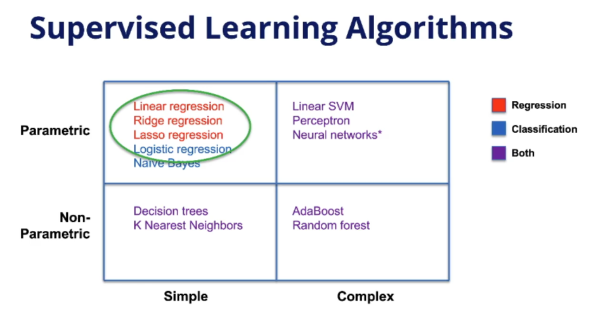
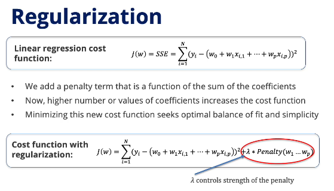

# Module 4) 선형 모델과 파라미터 기반 학습 

이번 모듈에서는 머신러닝 알고리즘의 기초가 되는 '선형 모델(Linear Models)'을 시작으로, 데이터를 학습하는 두 가지 큰 축인 파라메트릭(Parametric) 알고리즘과 논파라메트릭(Non-parametric) 알고리즘의 개념 및 장단점을 정리한다.

---

### 1. 파라메트릭 알고리즘 (Parametric Algorithms)

입력 데이터와 출력 데이터 사이의 관계를 모델링하기 위해 **미리 정해진 형태(Template)를 가정**하는 알고리즘이다. 선형 모델이 여기에 속한다.

* **학습 방식:** 모델의 뼈대(형태)는 고정되어 있으며, 훈련 데이터를 통해 템플릿을 완성할 **계수(Coefficients)**나 **파라미터(Parameters)**의 최적값을 찾아내는 것이 학습의 목적이다.
* **장점:** 구조가 단순하여 학습 속도가 빠르고, 데이터의 양이 적을 때도 비교적 잘 작동한다.
* **단점:** 사전에 정해진 형태에 얽매이기 때문에, 현실 세계의 복잡한 문제를 반영하기에는 모델이 너무 단순할 수 있다. 이로 인해 데이터를 충분히 학습하지 못하는 **과소적합(Underfitting)**이 발생하기 쉽다.

---

### 2. 논파라메트릭 알고리즘 (Non-parametric Algorithms)

데이터를 학습하기 전에 입력과 출력의 관계에 대해 **어떠한 특정한 형태나 템플릿도 미리 가정하지 않는** 알고리즘이다.

* **장점:** 사전에 정해진 틀이 없으므로 매우 유연하다. 복잡하고 비선형적인 데이터와 관계에 잘 적응하며, 결과적으로 더 높은 예측 성능을 보여주는 경우가 많다.
* **단점:** 구조를 스스로 찾아내야 하므로 학습에 훨씬 더 많은 데이터가 필요하다. 또한, 주어진 훈련 데이터의 세세한 노이즈까지 전부 외워버리는 **과적합(Overfitting)**에 빠지기 쉽다.

---

### 3. 모듈의 핵심 학습 목표: 주요 선형 모델들

지도 학습(Supervised Learning)에는 다양한 파라메트릭 및 논파라메트릭 알고리즘이 존재한다. 이번 모듈에서는 가장 기본이 되는 형태인 파라메트릭

----
## 📝 선형 회귀 (Linear Regression) 

선형 모델의 가장 기본이 되는 **선형 회귀(Linear Regression)**의 개념, 작동 원리, 그리고 한계를 극복하는 방법론에 대해 정리한다.

---

### 1. 단순하지만 여전히 중요한 이유

선형 회귀는 입력(Features)과 출력(Target) 사이에 선형적인 관계가 있다고 가정하는 단순한 모델이다. 하지만 실무와 연구에서 여전히 필수적으로 다루어지는 이유는 다음과 같다.

* **복잡한 모델의 뼈대:** 향후 배우게 될 신경망(Neural Networks) 등 복잡한 딥러닝 모델들의 수학적 기초가 된다.
* **훌륭한 기준점(Benchmark):** 머신러닝 프로젝트를 시작할 때 가장 먼저 적용해 보는 모델이다. 여기서 얻은 성능을 기준으로, 더 복잡한 알고리즘을 도입했을 때 실제로 성능이 개선되었는지 평가할 수 있다.
* **뛰어난 해석력:** 모델이 왜 그런 예측을 내렸는지, 각 특성이 결과에 어떤 영향을 미쳤는지 직관적으로 이해하고 설명하기 매우 쉽다.

---

### 2. 선형 회귀의 수학적 모델링

#### ① 단순 선형 회귀 (Simple Linear Regression)
단 하나의 특성(예: 방의 개수)만으로 타겟(예: 집값)을 예측하는 모델이다.

$$y = W_0 + W_1X$$

* **$W_0$ (편향, Bias):** y-절편을 의미한다. 입력값($X$)이 0일 때 모델이 예측하는 기본 타겟 값이다.
* **$W_1$ (가중치, Weight / 계수, Coefficient):** 특성 $X$에 곱해지는 값으로, 해당 특성이 타겟에 미치는 영향력의 크기와 방향을 나타낸다.

#### ② 다중 선형 회귀 (Multiple Linear Regression)
실제 문제에서는 방의 개수, 평수, 학군 등 여러 특성을 동시에 사용한다. 이 경우 각 특성마다 고유한 가중치가 부여되어 확장된다.

$$y = W_0 + W_1X_1 + W_2X_2 + W_3X_3 + \dots$$

---

### 3. 모델 학습의 핵심: 비용 함수 (Cost Function) 최소화

선형 회귀 모델을 '학습'시킨다는 것은, 데이터의 패턴을 가장 잘 설명할 수 있는 **최적의 가중치($W$) 조합을 찾아내는 과정**이다.

* **오차(Error) 계산:** 실제 값($y$)과 모델의 예측값($\hat{y}$)의 차이를 구한다.
* **오차제곱합 (SSE: Sum of Squared Errors):** 모델의 총오차를 구하기 위해, 모든 데이터 포인트에서 발생한 오차를 제곱하여 더한다. 이를 머신러닝에서는 **비용 함수(Cost Function)** 또는 **손실 함수(Loss Function)**라고 부른다.

$$SSE = \sum (\hat{y} - y)^2$$

선형 회귀 알고리즘의 목표는 훈련 데이터를 사용하여 이 SSE(비용 함수)의 값이 최소가 되게 만드는 가중치들을 계산해 내는 것이다. (선형 회귀의 경우 보통 수학적인 '닫힌 형태의 해(Closed-form solution)'를 통해 이 최솟값을 단번에 구한다.)

---

### 4. 비선형 데이터의 한계 극복: 다항 회귀 (Polynomial Regression)

데이터가 항상 예쁜 직선의 형태를 띠는 것은 아니다. 선형 회귀로 곡선 형태의 비선형 데이터를 모델링하려면 특성(Feature)을 변환해야 한다.

* **특성 변환:** 기존의 특성 $X$를 그대로 쓰는 대신, 제곱($X^2$), 세제곱($X^3$), 또는 로그($\log X$)를 취한 새로운 특성을 만들어 모델의 입력으로 제공한다.
* **효과:** 자동차의 마력(Horsepower)과 연비(MPG)처럼 단순 직선으로 포착할 수 없는 복잡한 패턴을 가진 데이터에 다항 회귀를 적용하면, 모델의 평균제곱오차(MSE)를 크게 줄이고 예측 성능을 획기적으로 높일 수 있다.

---
## 📝 정규화 (Regularization): 과적합 방지와 선형 모델의 진화

이전 레슨에서 다룬 기본 선형 회귀는 훈련 데이터의 오차(SSE)만을 최소화하도록 학습하기 때문에, 훈련 데이터에 너무 과도하게 맞춰지는 **과적합(Overfitting)** 문제가 발생하기 쉽다. 이를 해결하고 새로운 데이터에 대한 일반화 성능을 높이기 위해 도입된 핵심 기법이 바로 **정규화(Regularization)**이다.

### 1. 정규화의 핵심 원리: 패널티 부여

모델이 훈련 데이터에 지나치게 얽매이지 않고 적절한 유연성을 유지하려면, 훈련 데이터에 대한 '적합도(Fit)'와 모델의 '단순성(Simplicity)' 사이에서 균형을 찾아야 한다.

이를 위해 정규화는 기존의 비용 함수(Cost Function)에 모델의 복잡도(특성의 개수나 가중치의 크기)를 처벌하는 **패널티(Penalty)** 항을 추가한다.

$$Cost = SSE + \lambda \times \text{Penalty}$$

* **$SSE$:** 실제 예측값과 정답 간의 오차 제곱합
* **$\lambda$ (람다, Lambda):** 적용할 패널티의 강도를 조절하는 고정값이다. $\lambda$가 커질수록 모델에 더 강한 제약을 가해 형태를 단순화한다.

---

### 2. 두 가지 주요 정규화 기법: 라쏘(Lasso) vs 릿지(Ridge)

패널티를 계산하는 방식에 따라 크게 두 가지 회귀 기법으로 나뉜다.

#### ① 라쏘 회귀 (Lasso Regression)
* **패널티 방식:** 모델에 포함된 모든 계수(가중치)들의 **절대값의 합**을 패널티로 사용한다. (L1 정규화)
* **작동 특징:** 예측에 큰 도움이 되지 않는 불필요한 특성의 가중치를 **완전히 0으로 강제**한다.
* **활용 시기:** 가중치가 0이 된 특성은 수식에서 아예 배제되므로, 자연스럽게 **특성 선택(Feature Selection)**의 효과를 얻게 된다. 변수의 개수를 줄여 모델을 명확하게 해석하고 싶을 때 매우 유용하다.
$$\text{Penalty} = \lambda \sum_{j=1}^{p} \beta_j^2$$

#### ② 릿지 회귀 (Ridge Regression)
* **패널티 방식:** 모델에 포함된 모든 계수(가중치)들의 **제곱의 합**을 패널티로 사용한다. (L2 정규화)
* **작동 특징:** 관련성이 적은 특성의 가중치를 0에 아주 가깝게 축소하지만, 라쏘처럼 **완전히 0으로 없애지는 않는다.**
* **활용 시기:** 특성을 제거하지 않고 영향력만 억제하므로 특성 선택의 기능은 없다. 하지만, 타겟과 특성 간의 관계가 매우 복잡하거나 입력 특성들끼리 서로 강한 상관관계(다중공선성, Collinearity)를 가질 때 모델을 안정적으로 학습시키는 데 탁월하다.
$$\text{Penalty} = \lambda \sum_{j=1}^{p} |\beta_j|$$

| 구분 | Ridge Regression (L2 정규화) | LASSO Regression (L1 정규화) |
| :--- | :--- | :--- |
| **패널티 기준** | 가중치의 제곱합 ($\beta^2$) | 가중치의 절댓값 합 ($\beta$) |
| **가중치 결과** | 0에 가깝게 수렴 (0은 아님) | 정확히 0이 될 수 있음 |
| **주요 기능** | 모델 복잡도 감소, 변수 간 상관성 조절 | 변수 선택 (Feature Selection) |
| **비유** | 모든 변수를 소심하게 만듦 | 쓸모없는 변수를 해고함 |

---

### 💡 실무 적용 전략 및 심화 개념

* 수많은 특성을 가진 복잡한 데이터셋을 다룰 때, 단순히 일반 선형 회귀를 사용하는 것보다 정규화 기법을 적용하면 과적합을 막아 훨씬 더 우수한 예측 성능을 확보할 수 있다.
* 특성 제거(Lasso)가 필요한지, 가중치 억제(Ridge)가 필요한지 사전에 확신하기 어렵다면, **두 가지 방식을 모두 시도**해 본 뒤 예측 결과가 더 좋은 것을 최종적으로 선택하는 것이 가장 확실한 접근법이다.

**[면접/시험 단골 포인트: 라쏘는 왜 가중치가 0이 될까? (기하학적 해석)]**

머신러닝 면접이나 시험에서 가장 중요하게 다뤄지는 개념 중 하나는 두 정규화 기법의 기하학적 차이이다. 

* **Ridge (L2)의 제약 범위 (원 모양):** 가중치의 제약 범위가 둥근 **'원'** 모양이다. 오차를 나타내는 비용 함수의 등고선이 이 원과 만날 때, 둥근 형태적 특성 때문에 보통 축(Axis) 위가 아닌 지점에서 교점이 형성된다. 따라서 가중치의 크기가 전반적으로 작아지긴 하지만 정확히 0이 되기는 어렵다.
* **LASSO (L1)의 제약 범위 (마름모 모양):** 가중치의 제약 범위가 축 부분이 뾰족한 **'마름모(다이아몬드)'** 모양이다. 비용 함수의 등고선이 확장되다가 이 영역과 접촉할 때, 기하학적으로 뾰족한 모서리(즉, 축 위)에서 만날 확률이 매우 높다. 특정 축 위에서 교점이 생겼다는 것은 해당 변수의 가중치가 정확히 0이 된다는 것을 의미하며, 이것이 라쏘가 자연스럽게 변수 선택(Feature Selection)을 수행하는 근본적인 이유이다.
---
## 📝 로지스틱 회귀 (Logistic Regression): 선형 모델로 분류 문제 해결하기

지금까지 선형 모델을 활용해 연속적인 값을 예측하는 회귀(Regression) 문제를 다뤘다. 이번 레슨에서는 선형 모델의 개념을 확장하여, 데이터를 특정 범주(클래스)로 나누는 **분류(Classification)** 문제를 해결하는 **로지스틱 회귀**에 대해 알아본다.

### 1. 선형 회귀를 분류 문제에 바로 적용할 때의 한계

입력 변수 $X$를 이용해 출력 $Y$가 0 또는 1인 이진 분류(Binary Classification) 문제를 푼다고 가정해 보자. 기존의 선형 회귀 모델($y = W_0 + W_1X$)을 그대로 적용하면 다음과 같은 치명적인 문제들이 발생한다.

* **예측값의 의미 상실:** 실제 정답은 0 아니면 1인데, 선형 회귀는 그 사이의 애매한 소수점 값을 예측한다.
* **범위 이탈:** 심지어 예측값이 1을 초과하거나 0보다 작아지는 경우도 발생하여, 이를 어떻게 해석해야 할지 난감해진다.

---

### 2. 해결책: 확률 예측과 시그모이드(Sigmoid) 함수

이러한 문제를 해결하기 위해 예측의 목표를 바꾼다. 단순히 0이나 1을 맞추는 것이 아니라, **"Y가 1이 될 확률"**을 예측하는 것이다. 확률은 항상 0과 1 사이의 값을 가지므로 훨씬 논리적이다.

하지만 선형 회귀 식은 여전히 0 미만이나 1 초과의 값을 뱉어낼 수 있다. 이를 0과 1 사이로 압축하기 위해 도입하는 수학적 도구가 바로 **시그모이드 함수(Sigmoid Function, 로지스틱 함수)**이다.

* **모델의 구조:** 1. 선형 회귀 식을 계산한다: $Z = W_0 + W_1X_1 + W_2X_2 + \dots$
    2. 계산된 $Z$ 값을 시그모이드 함수에 통과시킨다.
    3. 결과값은 항상 0과 1 사이로 출력되며, 우리는 이를 **입력 데이터가 클래스 1에 속할 확률**로 해석한다.

---

### 3. 경사 하강법 (Gradient Descent): 최적의 가중치 찾기

로지스틱 회귀에서도 모델의 오차를 나타내는 비용 함수(Cost Function)를 정의하고, 이 비용을 최소화하는 최적의 가중치($W$)들을 찾아야 한다. 

* **닫힌 형태의 해 부재:** 일반 선형 회귀와 달리, 시그모이드 함수가 포함된 로지스틱 회귀는 수학적인 공식 한 줄로 최적값을 단번에 계산(Closed-form solution)할 수 없다.
* **해결책 (경사 하강법):** 1. 처음에는 무작위로 가중치를 찍어 점을 하나 선택한다 (임의의 출발점).
    2. 그 위치에서 기울기(Gradient, 미분값)를 계산한다. 기울기는 함수가 가장 가파르게 올라가는 방향을 가리킨다.
    3. 오차를 **최소화(내려가야 함)**하는 것이 목표이므로, 기울기의 **반대 방향**으로 이동한다.
    4. 한 번에 이동하는 보폭은 **학습률(Learning Rate)**이라는 파라미터와 기울기의 크기를 곱하여 결정한다.
    5. 오차가 더 이상 줄어들지 않는 바닥(최솟값)에 도달할 때까지 이 과정을 끊임없이 **반복(Iterative)**한다.

이러한 경사 하강법의 원리는 향후 딥러닝(신경망) 모델을 학습시키는 데 있어서도 가장 핵심적인 근간이 된다.

---
## 📝 소프트맥스 회귀 (Softmax Regression): 다중 클래스 분류의 완성

위 로지스틱 회귀에서는 결과가 두 가지(0 또는 1)로 나뉘는 이진 분류(Binary Classification) 문제를 로지스틱 회귀와 시그모이드 함수를 이용해 해결했다. 하지만 3개 이상의 여러 범주 중 하나를 예측해야 하는 **다중 클래스(Multi-class) 분류** 문제에서는 어떻게 해야 할까? 이를 해결해 주는 것이 바로 **소프트맥스 회귀**이다.

---

### 1. 로지스틱 회귀와의 구조적 차이점

로지스틱 회귀가 단일 클래스(주로 클래스 1)에 대한 확률만을 계산했다면, 소프트맥스 회귀는 가능한 모든 클래스에 대한 확률을 동시에 계산해야 한다.

* **독립적인 가중치 세트:** 하나의 가중치 세트를 모든 입력에 적용하는 대신, **각 클래스별로 고유한 가중치(Weights) 세트**를 가진다.
* **클래스별 $Z$ 값 계산:** 입력값($X$)에 각각의 클래스 전용 가중치를 곱하여, 각 클래스마다 별도의 $Z$ 값을 따로 계산한다.

---
### 2. 소프트맥스(Softmax) 함수의 핵심 역할: 확률의 정규화와 격차 극대화

계산된 각각의 $Z$ 값들을 확률로 변환하기 위해 시그모이드 대신 **소프트맥스 함수**를 사용한다. 소프트맥스는 일종의 '정규화된 시그모이드'라고 볼 수 있다.

* **0과 1 사이의 범위:** 시그모이드와 마찬가지로 각 클래스에 대한 결과값을 0과 1 사이로 압축한다.
* **확률의 총합은 1 (100%):** **모든 클래스에 대한 예측 확률 값을 다 더했을 때 정확히 1**이 되도록 비율을 조정(정규화)한다. 

**[💡 심화 개념: 왜 지수 함수($e^x$)를 사용할까?]**

소프트맥스 함수의 수학적 공식은 다음과 같다.

$$Softmax(x_i) = \frac{e^{x_i}}{\sum e^{x_j}}$$

이 공식의 핵심은 바로 **지수 함수($e^x$)**에 있다. 지수 함수는 값이 커질수록 폭발적으로 증가하는 특성을 가진다.

* **격차 증폭:** 만약 모델이 계산한 원시 점수($Z$)가 2와 1이라면, 단순한 비율은 2:1이다. 하지만 여기에 지수를 씌우면 $e^2(\approx 7.39)$와 $e^1(\approx 2.72)$이 되어 그 격차가 훨씬 크게 벌어진다.
* **명확한 결론 유도:** 즉, 가장 높은 점수를 받은 클래스('잘난 놈')에게는 더 큰 확신을 실어주고, 나머지 클래스는 확실하게 억눌러 버린다. 이를 통해 모델이 애매하게 판단하지 않고 명확한 결론을 내리도록 유도하는 것이 바로 '소프트맥스(Soft-max)'라는 이름에 담긴 진짜 역할이다.
---
### 3. 미분 관점: 최적의 "학습 통로" (Cross-Entropy와의 결합)

소프트맥스가 다중 클래스 분류에서 빛을 발하는 또 다른 진짜 이유는 **미분이 매우 깔끔하게 떨어진다는 점**이다. 

* **크로스 엔트로피(Cross-Entropy)와의 찰떡궁합:** 소프트맥스는 다중 분류 모델의 손실(비용) 함수로 주로 사용되는 크로스 엔트로피와 결합할 때 최고의 효율을 낸다.
* **단순명료한 오차 계산:** 이 둘을 결합하여 가중치 업데이트를 위한 미분(경사 하강법)을 수행하면, 복잡한 수학 공식들이 모두 소거되고 결국 **"예측값 - 실제값 (Error)"**이라는 아주 단순한 형태만 남게 된다.
* **학습의 최적화:** 즉, 모델이 예측을 틀린 만큼만 정확하게 가중치(계수)를 수정할 수 있는 **최적의 '학습 통로'**를 제공하는 셈이다.
---

### 4. 작동 원리 및 예시: 4가지 동물 분류 모델

개, 고양이, 토끼, 곰 4가지 동물을 분류하는 모델을 만든다고 가정해 본다.

1. **입력 데이터 설정:** 8x8 픽셀 크기의 이미지가 입력으로 들어온다면, 각 픽셀의 값 하나하나가 특성(Feature)이 되어 총 64개의 특성을 가진다.
2. **$Z$ 값 계산:** 이 64개의 픽셀 값들을 4개의 동물 클래스가 각각 가진 고유한 가중치들과 곱하여 4개의 $Z$ 값을 얻어낸다.
3. **소프트맥스 적용 및 확률 산출:** 이 값들을 소프트맥스 함수에 통과시키면 다음과 같은 확률 분포가 출력될 수 있다.
   * 개: $0.80$ (80%)
   * 고양이: $0.05$ (5%)
   * 토끼: $0.05$ (5%)
   * 곰: $0.10$ (10%)
   * **(총합 = 1.0)**
4. **최종 예측:** 이 모델은 가장 확률이 높은 범주를 찾아내어, 입력된 이미지를 **'개(Dog)'**로 최종 분류한다.
---
---
---

## ----모듈 전체 요약----

이번 모듈에서는 데이터 과학의 가장 강력한 기초인 선형 모델의 흐름을 학습했다. 연속적인 값의 예측부터 복잡한 다중 분류까지, 핵심 내용을 한눈에 들어오게 정리한다.

---

### 1. 선형 및 로지스틱 회귀 (Regression & Classification)

* **선형 회귀 (Linear Regression):** $y = WX + b$ 형태의 직선을 통해 수치를 예측한다. 오차 제곱합(SSE)을 최소화하는 방향으로 학습한다.
* **로지스틱 회귀 (Logistic Regression):** 이름은 회귀지만 실체는 **분류** 모델이다. 선형 식의 결과를 **시그모이드(Sigmoid) 함수**에 통과시켜 0~1 사이의 확률값으로 변환한다.

---

### 2. 정규화 (Regularization): 과적합 방지의 방패

모델이 훈련 데이터에만 너무 집착(Overfitting)하지 않도록 패널티를 부여하는 기술이다.

| 구분 | Ridge Regression (L2) | LASSO Regression (L1) |
| :--- | :--- | :--- |
| **패널티 기준** | 가중치의 제곱합 ($\beta^2$) | 가중치의 절댓값 합 ($\beta$) |
| **가중치 결과** | 0에 가깝게 수렴 (0은 아님) | 정확히 0이 될 수 있음 |
| **기하학적 모양** | **원형**: 축과 만나기 어려움 | **마름모**: 뾰족한 모서리(축)에서 만남 |
| **주요 기능** | 모델 복잡도 및 상관성 조절 | **변수 선택 (Feature Selection)** |
| **비유** | 모든 변수를 소심하게 만듦 | 쓸모없는 변수를 해고함 |

---

### 3. 소프트맥스 회귀 (Softmax Regression): 다중 분류의 완성

3개 이상의 클래스를 분류할 때 사용하며, **지수 함수($e^x$)**의 마법을 이용한다.

* **확률의 정규화:** 모든 클래스의 예측 확률 합을 정확히 **1(100%)**로 맞춘다.
* **격차 극대화:** 지수 함수를 통해 '잘난 놈'(높은 점수)에는 확신을, '못난 놈'은 확실히 죽여서 모델이 명확한 결론을 내리게 한다.
* **최적의 학습 통로:** Cross-Entropy 손실 함수와 결합하면 미분 결과가 **"예측값 - 실제값(Error)"**으로 깔끔하게 떨어진다. 모델이 틀린 만큼만 정확하게 가중치를 수정할 수 있는 고속도로를 깔아주는 셈이다.

---

### 4. 실무 전략: 왜 선형 모델부터 시작해야 하는가?

1.  **벤치마크(Benchmark):** 선형 모델은 가장 훌륭한 기준점이다. 복잡한 모델을 쓰기 전, 이 데이터에서 나올 수 있는 '최소한의 성능'을 확인하는 용도로 반드시 거쳐야 한다.
2.  **수학적 토대:** 여기서 배운 가중치 업데이트와 경사 하강법의 원리는 향후 배울 **신경망(Neural Networks)**의 핵심 엔진이 된다.
3.  **한계 인식:** 현실 데이터는 선형 모델이 그리는 직선보다 훨씬 복잡하고 비선형적(Non-linear)일 때가 많다. 이때가 바로 다음 모듈에서 배울 비모수적 알고리즘이 등판할 타이밍이다.

---

> **💡 핵심 요약**
> 선형 모델은 데이터 과학자가 가장 먼저 꺼내 들어야 할 날카로운 면도날이자, 딥러닝이라는 거대한 성으로 향하는 가장 견고한 징검다리이다.