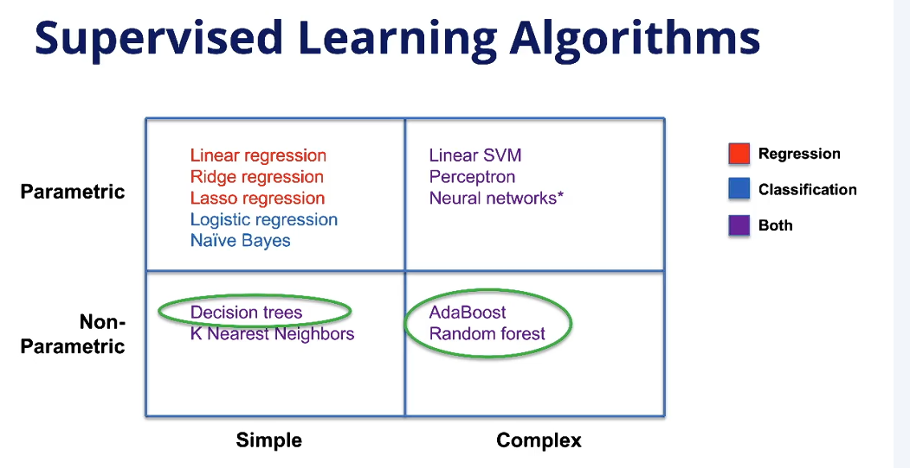
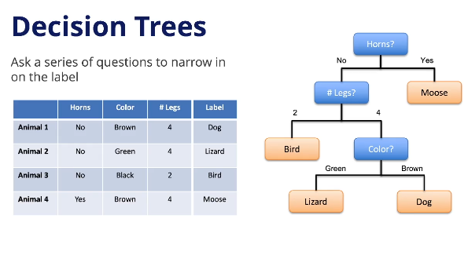
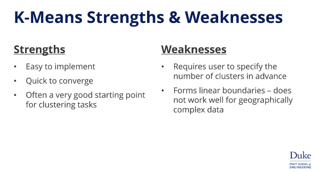

# 모듈 5 : 앙상블 모델 과 클러스터링 트리 모델 

Non-Parametric Models & Unsupervised Learning — 모듈 개요

## 이 모듈의 흐름

선형 모델(Linear Models)은 단순하고 해석이 쉽지만, 복잡한 현실 문제에서 **과소적합(Underfitting)** 이 발생하기 쉽다.

이를 극복하기 위해 이번 모듈에서는 **비모수 모델(Non-Parametric Models)** 을 다룬다.

---

## 다루는 주제

- **Decision Tree** — 트리 기반 모델의 기초
- **Ensemble Models / Random Forest** — 개별 모델을 결합해 성능 향상
- **Unsupervised Learning / K-Means Clustering** — 레이블 없이 데이터 구조 파악

---

## 모듈 학습 목표

| 주제 | 핵심 질문 |
| :--- | :--- |
| Tree vs Linear | 트리 기반 모델이 선형 모델과 어떻게 다른가? |
| Ensemble | 왜 단일 모델 대신 앙상블을 쓰는가? 어떻게 만드는가? |
| K-Means | 클러스터링이란 무엇이고, 어떤 상황에 적용하는가? |

---

markdown# 🌳 Decision Tree — 결정 트리

## 핵심 아이디어

일련의 질문(분기)을 통해 데이터를 좁혀가며 예측값을 도출하는 알고리즘이다.

---

## 분기 기준: 정보 이득 (Information Gain)

- **목표:** 최소한의 분기로 데이터를 효과적으로 분류
- **방법:** 매 분기마다 **불순도(Impurity) 감소량이 최대**인 feature + value 조합 선택
- 불순도 = 노드 내 클래스 혼합 정도. 완전히 분리되면 불순도 = 0

---

## 예측 방법

| 문제 유형 | 예측 방식 |
| :--- | :--- |
| 분류 (Classification) | 리프 노드에서 **다수결(Majority Vote)** |
| 회귀 (Regression) | 리프 노드에서 **평균값(Mean)** |

---

## 트리 깊이(Depth)와 과적합

| 깊이 | 문제 |
| :--- | :--- |
| 너무 얕음 | **과소적합(Underfitting)** — 패턴을 충분히 포착하지 못함 |
| 너무 깊음 | **과적합(Overfitting)** — 훈련 데이터의 노이즈까지 학습, 새 데이터 성능 저하 |

---

## 장점 / 단점

| 장점 | 단점 |
| :--- | :--- |
| 높은 해석 가능성 | 깊이 선택에 매우 민감 |
| 빠른 학습 속도 | 깊이가 깊으면 과적합 위험 |
| 비선형 관계 처리 가능 | — |
| 스케일링·인코딩 불필요 | — |
---
# 🎯 Ensemble Models — 앙상블 모델

## 핵심 아이디어

단일 모델의 과적합 문제를 해결하기 위해, **여러 모델을 결합해 하나의 메타 모델**을 만드는 전략이다.

> **핵심 인사이트:** 독립적인 모델들의 예측을 평균내면 **분산(Variance)이 낮아진다.**
> 분산이 낮아질수록 새로운 데이터에 대한 일반화 성능이 향상된다.

---

## 작동 방식

1. 원본 데이터셋에서 **여러 개의 서브 데이터셋** 생성
2. 각 데이터셋으로 **개별 모델(Member Model)** 학습
3. 각 모델의 예측을 **집계 함수(Aggregation Function)** 로 결합

| 문제 유형 | 집계 방식 |
| :--- | :--- |
| 분류 | 다수결(Majority Vote) |
| 회귀 | 단순 평균 or 가중 평균 |

> 모델들이 반드시 같은 알고리즘일 필요는 없다. 선형 모델 + 트리 모델을 섞는 것도 가능하다.

---

## 실제 활용 사례

- **기상 예측:** 각국 정부 기관의 개별 예보를 가중 평균으로 결합 → 단일 모델보다 높은 정확도
- **전력 수요 예측:** 불확실한 날씨 시나리오별로 개별 모델 생성 → 앙상블로 다음날 전력 생산 계획 수립

> **공통 인사이트:** 입력값 자체가 불확실한 상황에서, 앙상블은 그 불확실성을 모델 구조 안으로 흡수하는 효과적인 방법이다.

---

## 장점 / 단점

| 장점 | 단점 |
| :--- | :--- |
| 과적합 감소 | 학습 시간·자원 증가 |
| 일반화 성능 향상 | 예측 시 다수 모델 병렬 실행 필요 |
| — | **해석 가능성(Interpretability) 저하** |

> 단일 모델은 예측 근거를 추적하기 쉽지만, 앙상블은 각 모델의 내부 + 결합 방식까지 파악해야 하므로 해석이 훨씬 복잡해진다. **성능과 해석 가능성은 트레이드오프 관계**임을 인식해야 한다.
---
# 🌲 Random Forest — 랜덤 포레스트

## 핵심 아이디어

단일 Decision Tree의 **과적합 문제**를 해결하기 위해, 여러 트리를 독립적으로 학습시켜 결합하는 앙상블 모델이다.

> **핵심 인사이트:** 트리 하나는 과적합되기 쉽지만, 서로 독립적인 트리 여럿의 다수결은 노이즈에 훨씬 강하다. 독립성을 확보하는 것이 Random Forest의 핵심 설계 원칙이다.

---

## Bagging (Bootstrap Aggregating)

- **복원 추출(Sampling with Replacement)** 로 원본 데이터에서 여러 서브셋 생성
- 각 서브셋으로 개별 모델 학습 → 예측값을 평균/다수결로 결합
- 모델들이 서로 다른 데이터로 학습되므로 **독립성 확보 → 분산 감소**

Random Forest는 여기서 한 발 더 나아가, **행(Row)뿐 아니라 열(Feature)도 샘플링**한다.
이를 통해 트리 간 독립성을 더욱 강화한다.

---

## 주요 하이퍼파라미터 3가지

| 결정 사항 | 설명 | 인사이트 |
| :--- | :--- | :--- |
| **트리 수** | 앙상블에 포함할 트리 개수 | 많을수록 안정적이나 연산 비용 증가 |
| **샘플링 전략** | 행/열 샘플링 비율 | 비율이 낮을수록 트리 간 독립성 높아짐 |
| **트리 깊이** | 최대 깊이 or 리프당 최소 샘플 수 | 리프당 최소 샘플 수 설정이 과적합 방지에 효과적 |

> **리프당 최소 샘플 수**는 트리가 노이즈에 과적합되는 것을 막는 실용적인 제어 장치다. 단순히 최대 깊이를 제한하는 것보다 데이터 밀도 기반으로 트리 성장을 멈추는 더 유연한 방식이다.

---

## 장점 / 단점

| 장점 | 단점 |
| :--- | :--- |
| 과적합에 강함 | 단일 트리 대비 해석 가능성 저하 |
| 비선형 관계 처리에 탁월 | 하이퍼파라미터 결정 부담 증가 |
| 복잡한 현실 문제에 높은 성능 | — |
---
# 🔵 Clustering — 클러스터링

## 핵심 아이디어

레이블(정답)이 없는 상태에서, 데이터를 **유사한 것끼리 같은 그룹**으로 묶는 비지도 학습 기법이다.

> 핵심 인사이트: 지도 학습은 "정답을 맞히는" 문제지만, 클러스터링은 "데이터 안에서 구조를 발견하는" 문제다. 정답이 존재하지 않으며, 어떤 기준으로 유사성을 정의하느냐가 곧 분석의 방향을 결정한다.

---

## 실제 활용 사례

- 유전학: 유전 데이터의 유사성으로 집단 구조 추론
- 마케팅: 고객을 세그먼트로 분류해 타겟 전략 수립
- 뉴스 분류: 텍스트 유사성 기반으로 기사를 주제별 그룹화

---

## 핵심 의사결정: 유사성의 기준

클러스터링에서 가장 중요한 결정은 **무엇을 기준으로 유사성을 판단할 것인가**이다.

> 인사이트: 같은 데이터도 기준이 달라지면 전혀 다른 클러스터가 만들어진다. 사과주스와 맥주는 색깔 기준으로는 같은 클러스터, 재료 기준으로는 다른 클러스터에 속한다. 유사성 기준의 선택은 도메인 지식과 분석 목적에 따라 달라지며, 정해진 정답이 없다.

# 🔵 K-Means Clustering — K-평균 클러스터링

## 핵심 아이디어

클러스터 중심(Centroid)과 각 데이터 포인트 간의 **거리 합을 최소화**하도록 데이터를 K개의 그룹으로 나누는 알고리즘이다.

---

## 작동 방식

1. 클러스터 수 K 선택
2. K개의 중심점을 **랜덤하게 초기화**
3. 각 데이터 포인트를 **가장 가까운 중심점의 클러스터에 할당**
4. 각 클러스터의 중심점을 **소속 데이터 포인트들의 평균 위치로 이동**
5. 중심점이 더 이상 움직이지 않을 때까지 3~4 반복

> 인사이트: 초기 중심점이 랜덤하게 설정되기 때문에, 실행할 때마다 결과가 달라질 수 있다. 알고리즘이 수렴하더라도 그것이 전역 최적(Global Optimum)임을 보장하지는 않는다.

---

## 장점 / 단점

| 장점 | 단점 |
| :--- | :--- |
| 구현이 단순하고 빠르게 수렴 | K를 사전에 지정해야 함 |
| 대부분의 클러스터링 문제에서 좋은 출발점 | 복잡한 비선형 경계를 가진 데이터에 취약 |

---

## K를 모를 때의 접근법

K를 모르는 경우, 여러 K값으로 실행해보고 **총 거리 오차가 낮으면서 도메인 직관과도 맞는 K**를 선택한다.

> 인사이트: 클러스터 수는 순수하게 수학적으로만 결정할 수 없다. 오차 지표와 도메인 지식을 함께 고려하는 판단의 영역이다.
