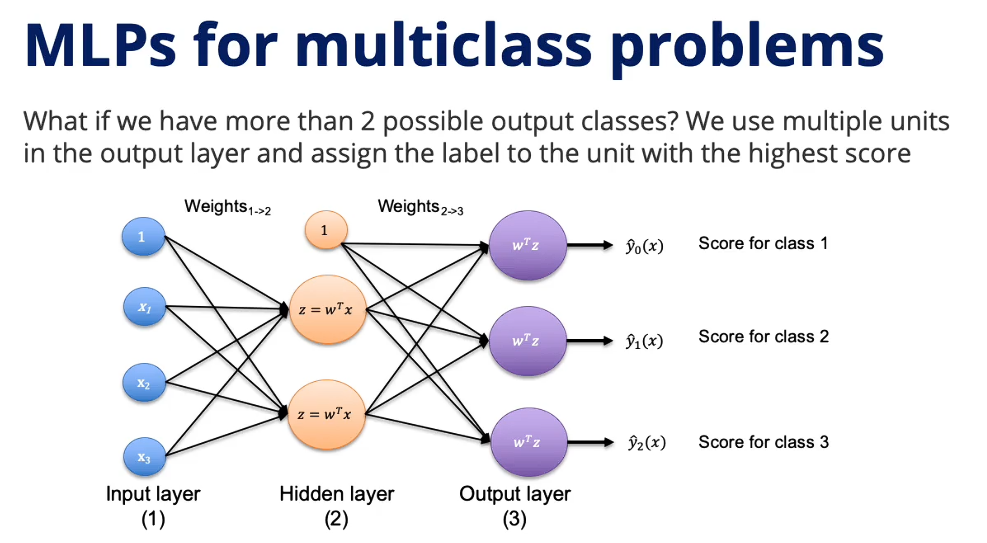
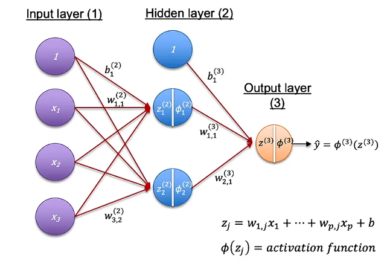
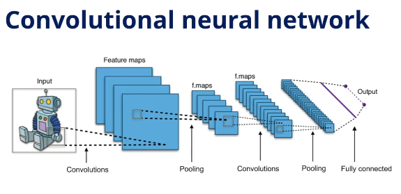

# 모듈 6 : 딥러닝 &  프로젝트 관리 

# 🧠 Deep Learning & Neural Networks — 개요

## 기원: 뇌의 뉴런에서 출발
- 별로 안중요해 보여서.. 넘어가겠습니다. 

## 딥러닝이 잘 작동하는 조건

- 대규모 학습 데이터가 있을 때
- 피처 수가 매우 많은 비정형 데이터 (이미지, 텍스트, 영상)
- 입력과 출력 사이의 관계가 복잡하고 비선형일 때
- **설명 가능성(Explainability)에 대한 요구가 낮을 때**

> 인사이트: 딥러닝은 본질적으로 블랙박스다. 이미지 태깅이나 피자 품질 검사처럼 결과만 중요한 경우엔 문제없지만, 대출 심사나 입학 결정처럼 **의사결정의 근거를 설명해야 하는 고위험 상황에서는 사용에 신중해야 한다.**
---
# 🧠 Artificial Neurons & Training — 인공 뉴런과 학습

## 인공 뉴런의 구조

입력 $x$에 가중치 $w$를 곱해 합산한 뒤, 활성화 함수를 통과시켜 출력을 생성한다.

$$z = \sum w_i x_i \quad \rightarrow \quad \hat{y} = f(z)$$

| 뉴런 유형 | 활성화 함수 | 출력 |
| :--- | :--- | :--- |
| Perceptron | 임계값 함수 (threshold) | $+1$ or $-1$ |
| Logistic Regression | 시그모이드 (sigmoid) | $P(y=1)$ |

> 인사이트: 퍼셉트론과 로지스틱 회귀는 사실상 선형 모델의 연장선이다. 뉴런 하나는 선형 결합 + 활성화 함수에 불과하다. 딥러닝의 힘은 이것을 수천 개 쌓았을 때 나온다.

---

## 학습 과정: Gradient Descent

비선형 활성화 함수가 도입되면 가중치의 닫힌 해(Closed-form Solution)를 구할 수 없다.
따라서 **경사하강법(Gradient Descent)** 으로 반복적으로 최솟값을 찾는다.

$$w \leftarrow w - \alpha \cdot \frac{\partial \text{Cost}}{\partial w}$$

- **Forward Propagation:** 데이터를 모델에 통과시켜 예측값 $\hat{y}$ 계산
- **Cost & Gradient 계산:** 예측값과 실제값의 차이로 손실 계산, 각 가중치에 대한 기울기 계산
- **Weight Update:** 기울기 반대 방향으로 가중치 업데이트

### 학습률(Learning Rate)의 중요성

> 인사이트: 학습률은 너무 작으면 수렴이 느리고, 너무 크면 최솟값을 지나쳐 발산한다. 딥러닝 학습에서 가장 민감한 하이퍼파라미터 중 하나다.

---

## Gradient Descent의 세 가지 방식

| 방식 | 업데이트 단위 | 장점 | 단점 |
| :--- | :--- | :--- | :--- |
| Stochastic GD | 데이터 1개씩 | 온라인 학습에 적합 | 벡터 연산 불가, 느림 |
| Batch GD | 전체 데이터 | 벡터 연산으로 효율적 | 대용량 데이터에서 연산 부담 |
| Mini-Batch GD | 소규모 배치 (예: 32개) | 효율성 + 확장성 균형 | 온라인 학습에는 부적합 |

> 인사이트: Mini-Batch GD는 Stochastic과 Batch의 절충안으로, 실제 딥러닝 학습에서 가장 널리 쓰이는 방식이다. 배치 크기 자체도 성능에 영향을 미치는 하이퍼파라미터다.
---
# 🧠 From Neurons to Neural Networks — 뉴런에서 신경망으로

## 핵심 아이디어

단일 뉴런은 **선형 결정 경계**만 만들 수 있다.
뉴런을 여러 개 쌓으면 **비선형 결정 경계**를 근사할 수 있다.

> 인사이트: 딥러닝의 본질은 단순한 선형 연산의 반복이다. 비선형성은 활성화 함수에서 나오고, 복잡성은 레이어를 쌓는 것에서 나온다.

---

## 신경망의 구조

| 레이어 | 역할 |
| :--- | :--- |
| 입력층 (Input Layer) | 원본 피처 $x$ 입력 |
| 은닉층 (Hidden Layer) | 선형 결합 $z = \sum w_i x_i$ → 활성화 함수 $\phi(z)$ 통과 |
| 출력층 (Output Layer) | 최종 예측값 $\hat{y}$ 생성 |

다중 클래스 분류의 경우, 출력층에 클래스 수만큼 노드를 두고 **가장 높은 점수의 클래스**를 예측값으로 선택한다.

---

## 활성화 함수의 역할

단순 임계값 함수(퍼셉트론) 대신 비선형 활성화 함수를 사용하면 복잡한 관계를 더 잘 모델링할 수 있다.

- Sigmoid
- Hyperbolic Tangent (tanh)
- **ReLU** — 현재 가장 널리 사용됨

> 인사이트: 활성화 함수가 없으면 레이어를 아무리 쌓아도 결국 하나의 선형 모델과 동일하다. 비선형 활성화 함수가 곧 딥러닝의 표현력(Expressiveness)의 원천이다.

---

## 역전파(Backpropagation)

1980년대에 보급된 역전파는 다층 신경망을 효과적으로 학습시키는 방법이다.
각 레이어의 가중치에 대한 기울기를 **출력층에서 입력층 방향으로 역방향 계산**해 업데이트한다.

> 인사이트: 역전파가 등장하기 전까지 다층 신경망은 이론으로만 존재했다. 학습 방법의 부재가 수십 년간 딥러닝 발전을 막았던 핵심 병목이었다.

---
# 🧠 Training Neural Networks — 신경망 학습

## 핵심 흐름: Forward → Cost → Backprop → Update

1. **Forward Propagation:** 데이터를 입력층 → 은닉층 → 출력층으로 통과시켜 $\hat{y}$ 계산
2. **Cost & Gradient 계산:** 실제값 $y$와 비교해 손실 계산, **연쇄 법칙(Chain Rule)** 으로 각 레이어 가중치에 대한 기울기 계산
3. **Backpropagation:** 출력층 → 입력층 방향으로 역방향 이동하며 각 레이어 가중치 업데이트
4. 수렴할 때까지 반복

> 인사이트: 단일 뉴런 학습과 원리는 동일하다. 레이어가 여러 개라 기울기 계산에 연쇄 법칙이 필요할 뿐이다.

---

## 설계 결정 사항들

신경망 설계에서 결정해야 할 하이퍼파라미터가 많다.

- 레이어 수, 레이어당 노드 수
- 활성화 함수 종류
- 정규화(Regularization) 적용 여부
- Gradient Descent 방식 (SGD / Mini-Batch / Batch)
- 학습률(Learning Rate)

---

## 두 가지 실용적 접근법

### 1. Stretch Pants 접근법

문제보다 **큰 네트워크**를 먼저 만들고, 정규화 등으로 과적합을 줄여가며 최적 크기로 수렴시킨다.

> 인사이트: 처음부터 완벽한 크기를 맞추려 하기보다, 크게 시작해서 줄이는 것이 현실적으로 더 효율적이다.

### 2. Transfer Learning — 전이 학습

누군가 대규모 데이터로 사전 학습(Pre-trained)시킨 모델을 가져와, **마지막 몇 개 레이어만 교체 후 특정 태스크에 맞게 fine-tuning**한다.

> 인사이트: 데이터가 부족하거나 학습 비용이 클 때 강력한 전략이다. 대부분의 딥러닝 실무에서 모델을 처음부터 학습시키는 경우는 드물다. 사전 학습된 모델이 이미 저수준 피처(엣지, 패턴 등)를 학습해두었기 때문에, fine-tuning만으로 높은 성능을 얻을 수 있다.

---

# 🖼️ Computer Vision — 컴퓨터 비전

## 주요 태스크

| 태스크 | 설명 | 예시 |
| :--- | :--- | :--- |
| Image Classification | 이미지 전체를 하나의 클래스로 분류 | 안면 인식, 폐 질환 분류 |
| Object Detection | 객체의 종류 + 위치(Bounding Box) 동시 파악 | 자율주행 보행자 감지 |
| Semantic Segmentation | 픽셀 단위로 클래스 분류 | 의료 영상에서 뼈/조직 경계 파악 |
| Image Generation | GAN으로 학습 데이터 기반 이미지 생성 | 딥페이크 |

---

## 이미지를 모델에 입력하는 방법

이미지의 각 픽셀을 **RGB 3채널 값(0~255)** 으로 변환해 피처로 사용한다.

> 인사이트: 1080×1920 이미지 하나가 약 620만 개의 피처를 가진다. 일반적인 Fully Connected Layer로는 가중치 수가 폭발적으로 늘어나 학습이 불가능해진다. 이것이 CNN이 필요한 이유다.

---

## CNN의 핵심 구조

### Convolutional Layer

- 작은 필터(예: 3×3)를 이미지 전체에 슬라이딩하며 적용
- 노드는 이전 레이어의 **일부 노드**에만 연결되고, 가중치를 **공유**
- 결과: 가중치 수 대폭 감소 + **Feature Map** 생성

> 인사이트: 초기 레이어는 엣지·색상 같은 단순 패턴을, 깊은 레이어로 갈수록 더 복잡한 패턴을 인식한다. 레이어가 쌓일수록 추상화 수준이 높아진다.

### Pooling Layer

- Feature Map의 작은 구역(예: 3×3)을 하나의 값(최대값 or 평균값)으로 압축
- 차원을 줄여 이후 레이어의 가중치 수를 관리 가능한 수준으로 유지

---

## 실무에서의 접근: Transfer Learning

대부분의 컴퓨터 비전 모델은 **ImageNet**(1,400만 장, 2만 개 카테고리)으로 사전 학습된 모델을 기반으로 한다.

> 인사이트: 처음부터 CNN을 설계하고 학습시키는 것은 매우 어렵고 비용이 크다. 실무에서는 사전 학습 모델의 마지막 몇 레이어만 교체해 fine-tuning하는 방식이 표준이다.

---
# 🗣️ Natural Language Processing (NLP) — 자연어 처리

## 주요 응용 분야

| 태스크 | 설명 | 예시 |
| :--- | :--- | :--- |
| Text Classification | 텍스트를 클래스로 분류 | 스팸 탐지, 뉴스 카테고리 분류 |
| Sentiment Analysis | 텍스트의 감정(긍정/부정) 판별 | 트위터 소비자 감성 분석, 리뷰 분석 |
| Search & QA | 의미 기반 검색 및 질의응답 | "mean"과 "average"를 같은 의미로 이해하는 검색 |
| Machine Translation | 언어 간 자동 번역 | Google Translate |
| Text Generation | 텍스트 자동 생성 | 이메일 자동 응답 생성 |

> 인사이트: NLP의 핵심 과제는 **"의미"를 컴퓨터가 다룰 수 있는 숫자로 변환**하는 것이다. 이 변환 방식의 발전이 곧 NLP 역사의 발전이다.

---

## 텍스트를 숫자로 변환하는 3가지 방법

### 1. Bag of Words (BoW) — 단어 빈도 기반

문서 내 단어들의 **출현 횟수**를 피처로 사용한다.

- 전체 문서에서 **어휘집(Vocabulary)** 을 구성
- 각 문서를 어휘집의 단어별 출현 횟수 벡터로 표현

**한계:**
- 어휘집이 커질수록 피처 행렬이 매우 희소(Sparse)해짐
- 단어의 **순서와 의미**를 전혀 반영하지 못함
- "mean"과 "average"가 같은 의미임을 알 수 없음

> 인사이트: BoW는 단순하지만, 의미를 무시한다는 근본적 한계가 있다. 텍스트를 단순한 "단어 주머니"로 보는 것이다.

---

### 2. Word Embeddings — 의미 기반 벡터 표현

단어를 **수십~수백 차원의 실수 벡터**로 표현해 단어의 **의미**를 수치적으로 포착한다.

- 의미가 유사한 단어(예: learn, study)는 벡터 공간에서 **가까이** 위치
- 의미가 다른 단어(예: sleep)는 **멀리** 위치
- 대표 모델: **Word2Vec** (Google, 2013), **GloVe** (Stanford, 2014)

**핵심 장점:**
- 사전 학습된(Pre-trained) 임베딩을 그대로 가져다 쓸 수 있음
- Wikipedia, Google News, Twitter 등 대규모 코퍼스로 학습된 임베딩 공개 사용 가능

> 인사이트: 임베딩은 Transfer Learning의 NLP 버전이다. 의미 구조가 이미 학습된 벡터를 가져다 쓰면, 적은 데이터로도 좋은 출발점을 확보할 수 있다. "mean"과 "average"의 임베딩 벡터는 서로 매우 가깝기 때문에, 임베딩 기반 검색은 의미적 유사성을 포착할 수 있다.

---

### 3. Transformer & Attention — 문맥 기반 이해

현재 NLP의 **지배적인 아키텍처**로, 텍스트 생성·번역 등 시퀀스 모델링 전반에서 압도적인 성능을 보인다.

**구성 요소:**

| 요소 | 역할 |
| :--- | :--- |
| Word Embedding | 단어를 의미 벡터로 변환 |
| Positional Encoding | 문장 내 단어의 **위치 정보** 추가 |
| Attention | 문장 내 단어 간 **관계의 강도** 측정 |

**Attention의 핵심 아이디어:**

> "The boy didn't study for the test because **he** was too tired."

위 문장에서 **"he"** 가 **"boy"** 를 가리킨다는 것을 사람은 자연스럽게 안다.
하지만 두 단어는 문장 내에서 꽤 멀리 떨어져 있다.

Attention은 **위치에 관계없이** 단어 간 연관성을 수치화해, 모델이 문맥을 훨씬 풍부하게 이해할 수 있게 한다.

> 인사이트: BoW → Embedding → Transformer로 이어지는 발전은 "단어의 존재" → "단어의 의미" → "단어 간 관계와 문맥"을 포착하는 방향으로 진화해왔다. Transformer가 강력한 이유는 단순히 더 많은 파라미터 때문이 아니라, **문맥을 구조적으로 이해하는 Attention 메커니즘** 덕분이다. GPT, BERT 등 현재의 대형 언어 모델들이 모두 Transformer 기반이다.

---

## 아이디어 메모

- **감성 분석 + 시계열:** 특정 기업에 대한 트위터 감성을 일별로 집계하면 주가나 소비자 반응의 선행 지표로 활용 가능
- **의미 기반 검색:** BoW 기반 키워드 검색을 임베딩 기반 검색으로 교체하면 동의어·유사어를 자동으로 처리 가능
- **자동 응답 시스템:** 이메일/문의의 패턴을 학습해 반복적 질문에 자동 초안 생성 → 업무 자동화 가능성
- **도메인 특화 fine-tuning:** 사전 학습된 Transformer 모델(예: BERT)을 특정 산업 텍스트(의료, 법률, 금융)로 fine-tuning하면 도메인 전문 NLP 모델 구축 가능