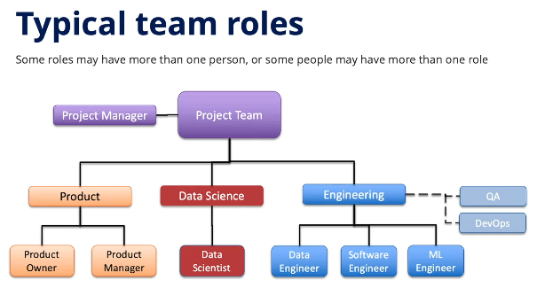

# Managing Machine Learning Projects

## Module 2 — Organizing ML Projects

### Project Teams / Organizing the Project / Measuring Performance

---

## 한 줄 요약

ML 프로젝트는 모델만 잘 만들면 끝나는 일이 아니라, **제품·데이터·모델·엔지니어링·비즈니스가 함께 움직이는 협업 프로젝트**입니다. 따라서 역할을 명확히 나누고, 고객 검증을 반복하며, 모델의 기술 성능뿐 아니라 실제 비즈니스 성과까지 함께 측정해야 합니다.

---

# 1. Team Organization

## 핵심 개념

ML 프로젝트 팀을 구성하는 정답은 하나가 아닙니다. 회사 규모, 조직 구조, 프로젝트 성격에 따라 팀의 형태는 달라질 수 있습니다.

```text
큰 조직
→ 여러 역할이 분리되어 있음

스타트업 / 개인 프로젝트
→ 한 사람이 여러 역할을 동시에 수행할 수 있음

프로젝트 전담팀
→ 모든 팀원이 하나의 프로젝트에 집중

Matrix 조직
→ 구성원이 여러 부서에 흩어져 있고, 다른 업무도 함께 수행
```

중요한 것은 직함이 아니라 **각 역할이 어떤 책임을 가지는지 이해하는 것**입니다.

---

## ML 프로젝트 팀의 주요 역할

일반적인 ML 프로젝트 팀은 크게 Product, Data Science, Engineering 역할로 나눌 수 있습니다.

| 영역 | 역할 | 핵심 책임 |
| :--- | :--- | :--- |
| Product | Product Owner | 기술 요구사항 정의, 제품 개발 방향 관리 |
| Product | Product Manager | 시장 요구를 제품 요구사항으로 변환, 영업/마케팅과 연결 |
| Data Science | Data Scientist | 데이터 분석, 모델 접근 방식 결정, 프로토타입 모델 개발 |
| Engineering | Data Engineer | 데이터 수집, 정제, 관리, 데이터 파이프라인 구축 |
| Engineering | Software Engineer | 모델을 실제 제품/서비스와 통합 |
| Engineering | ML Engineer | 프로토타입 모델을 production-grade 모델과 시스템으로 구현 |
| Engineering | QA | 모델과 제품 테스트 |
| Engineering | DevOps | 인프라, 배포, 운영 환경 관리 |
| Business | Sales / Marketing / Customer Support | 고객 피드백, 시장 출시, 고객 지원 |
| Leadership | Business Sponsor | 자원 확보, 전략 정렬, 프로젝트 보호 |

---

## Product Owner와 Product Manager

Product Owner는 제품의 기술적 요구사항을 정의하고 개발 방향을 관리합니다. Product Manager는 시장과 고객의 요구를 이해하고, 이를 구체적인 제품 요구사항으로 바꾸는 역할을 합니다.

특히 Product Manager는 제품 개발팀 내부뿐 아니라 마케팅, 세일즈, 고객 지원 조직과도 연결되어야 합니다.

```text
고객 / 시장 요구
→ Product Manager가 해석
→ Product Owner와 함께 제품 요구사항으로 변환
→ 개발팀이 구현
```

---

## Data Scientist의 역할

Data Scientist는 데이터를 분석하고, 모델링 접근 방식을 결정하며, 여러 알고리즘을 실험하는 역할을 합니다.

주요 책임은 다음과 같습니다.

```text
데이터 탐색
데이터에서 insight 도출
모델링 전략 결정
여러 알고리즘 평가
프로토타입 모델 개발
feature와 target 관계 분석
```

Data Scientist는 통계나 데이터 과학 배경을 가진 경우가 많고, 프로그래밍 역량도 필요합니다. 다만 일반적으로 소프트웨어 개발 경험은 ML Engineer나 Software Engineer보다 적을 수 있습니다.

가능하면 Data Scientist는 도메인 지식도 가지고 있는 것이 좋습니다. 그래야 데이터가 의미하는 바를 이해하고, 문제를 올바르게 framing할 수 있습니다.

---

## Data Engineer의 역할

Data Engineer는 ML 프로젝트에서 데이터를 실제로 쓸 수 있는 형태로 만드는 역할을 합니다.

```text
내부 DB에서 데이터 수집
고객 시스템에서 데이터 수집
외부 데이터 소스 연결
데이터 정제
데이터 파이프라인 구축
모델링 가능한 형태로 데이터 준비
```

Data Scientist가 모델을 만들 수 있으려면, 먼저 Data Engineer가 안정적인 데이터 흐름을 만들어줘야 합니다.

쉽게 말해 Data Engineer는 모델이 먹을 수 있는 “데이터 재료”를 준비하는 역할입니다.

---

## Software Engineer의 역할

Software Engineer는 모델을 실제 제품 안에 통합하는 역할을 합니다.

모델은 혼자 존재하는 것이 아니라, 보통 웹 서비스, 앱, API, 대시보드, 추천 시스템, 자동화 시스템 등 더 큰 제품 안에 들어갑니다.

```text
모델 출력
→ API 또는 백엔드 시스템과 연결
→ 사용자 인터페이스에 반영
→ 실제 제품 기능으로 제공
```

즉, Software Engineer는 모델과 제품 사이의 연결부를 만드는 사람입니다.

---

## ML Engineer의 역할

ML Engineer는 Data Scientist가 만든 프로토타입 모델을 실제 운영 가능한 production-grade 시스템으로 만드는 역할을 합니다.

```text
Data Scientist
→ 탐색, 실험, 프로토타입 모델 개발

ML Engineer
→ production data pipeline 구현
→ production model 구현
→ 배포 가능한 ML 시스템 구축
→ Software Engineer / DevOps와 협업
```

Data Scientist가 “이런 모델링 접근이 좋겠다”를 찾는 사람이라면, ML Engineer는 “그 모델을 실제 서비스에서 안정적으로 돌아가게 만드는 사람”에 가깝습니다.

---

## Data Scientist vs ML Engineer

| 구분 | Data Scientist | ML Engineer |
| :--- | :--- | :--- |
| 주된 배경 | 통계, 데이터 과학 | 컴퓨터공학, 소프트웨어 엔지니어링 |
| 핵심 관심 | 데이터 분석, 모델 실험, insight | production 시스템, 배포, 안정성 |
| 주요 업무 | 알고리즘 비교, 모델 프로토타입, feature 탐색 | 모델 운영화, 파이프라인 구현, 시스템 통합 |
| 산출물 | 분석 결과, 실험 모델, 모델링 전략 | 실제 서비스 가능한 모델 시스템 |
| 협업 대상 | 도메인 전문가, Data Engineer, ML Engineer | Data Scientist, Software Engineer, DevOps |

---

## 프로젝트 생애주기별 역할 변화

ML 프로젝트에서는 단계에 따라 핵심 역할의 비중이 달라집니다.

| 단계 | 주요 역할 | 설명 |
| :--- | :--- | :--- |
| 초기 문제 정의 | Product Owner, Product Manager, Business Sponsor | 문제, 고객, 비즈니스 목표 정렬 |
| 데이터 수집/이해 | Data Engineer, Data Scientist | 데이터 소스 식별, 수집, 품질 확인 |
| 모델 탐색/프로토타입 | Data Scientist | 알고리즘 실험, feature 탐색, 초기 모델 개발 |
| production 구현 | ML Engineer, Software Engineer | 모델과 파이프라인을 실제 서비스 수준으로 구현 |
| 배포/운영 | DevOps, Software Engineer, ML Engineer, QA | 인프라, 배포, 모니터링, 테스트 |
| 상용화/고객 지원 | Product Manager, Sales, Marketing, Customer Support | 고객 도입, 교육, 피드백 수집 |

Product 팀은 프로젝트 시작부터 배포 이후까지 계속 관여합니다. 반면 Data Scientist는 초반 탐색과 프로토타입 단계에서 특히 중요하고, ML Engineer와 Software Engineer는 후반 production 구현과 배포 단계에서 더 중요해집니다.

---

## Business Sponsor의 중요성

ML 프로젝트에는 Business Sponsor 또는 Champion이 필요합니다. 보통 조직 내 관리자나 임원급 인물이 이 역할을 맡습니다.

Business Sponsor의 역할은 다음과 같습니다.

```text
프로젝트에 필요한 자원 확보
프로젝트 목표와 회사 전략 정렬
불확실성이 큰 상황에서 프로젝트 보호
팀이 외부 압박에 흔들리지 않도록 지원
```

ML 프로젝트는 기술적 불확실성이 크기 때문에 중간에 성과가 잘 안 보이는 시기가 생길 수 있습니다. 이때 Business Sponsor가 없으면 팀이 자원 부족이나 조직 압박으로 흔들리기 쉽습니다.

---

# 2. Organizing the Project

## 핵심 개념

ML 프로젝트는 선형적으로 진행되지 않습니다. CRISP-DM의 각 단계는 반복적이며, 프로젝트 전체도 고객 피드백과 실험 결과에 따라 계속 앞뒤로 움직입니다.

```text
가설 설정
→ 작은 실험
→ 고객 피드백
→ 학습
→ 가설 수정
→ 다음 실험
```

이 반복 구조를 통해 팀은 “우리가 올바른 문제를 풀고 있는가?”, “고객이 실제로 이 제품을 쓸 것인가?”, “모델이 비즈니스 가치를 만들 수 있는가?”를 계속 검증합니다.

---

## 고객 검증이 중요한 이유

ML 프로젝트는 기술적으로 멋진 모델을 만드는 것만으로는 성공하지 않습니다. 사용자가 실제로 문제를 해결할 수 있어야 합니다.

따라서 프로젝트가 진행되는 동안 고객과 계속 검증해야 합니다.

```text
우리가 이해한 문제가 맞는가?
고객이 이 해결책을 가치 있다고 느끼는가?
제품의 형태가 고객 업무 흐름에 맞는가?
모델 결과를 고객이 신뢰할 수 있는가?
현재 방향으로 계속 가도 되는가?
```

---

## 반복적 고객 검증 예시

강의에서는 고객 검증이 점점 구체화되는 방식으로 진행된다고 설명합니다.

### 1차 검증: Mockup

프로젝트 초기에 간단한 wireframe이나 screenshot mockup을 만들어 고객에게 보여줍니다.

목적은 모델 성능 검증이 아니라, 문제 이해와 제품 방향 검증입니다.

```text
Business Understanding 단계
→ 간단한 mockup 제작
→ 고객에게 보여줌
→ 문제 이해와 기대 impact 검증
```

---

### 2차 검증: Mocked-up Model

다음 단계에서는 일부 historical data를 수집하고, 실제 모델은 아니지만 모델처럼 보이는 mocked-up model을 사용해 고객 반응을 확인합니다.

```text
Data Understanding 단계 일부 진입
→ 작은 historical data 사용
→ 가짜 모델 또는 시뮬레이션 결과 제시
→ 고객 피드백 수집
```

이 단계의 목적은 “모델이 진짜로 잘 맞는가?”보다 “이런 형태의 결과가 고객에게 의미 있는가?”를 확인하는 것입니다.

---

### 3차 검증: Heuristic Prototype

다음에는 실제 데이터를 사용하되, 아직 복잡한 ML 모델 대신 간단한 휴리스틱을 사용해 작동하는 prototype을 만듭니다.

```text
실제 데이터 수집 및 정제
→ ML 모델 대신 단순 휴리스틱 사용
→ 작동하는 prototype 제작
→ 고객에게 테스트
```

이 단계는 매우 중요합니다. 단순한 규칙만으로도 고객에게 충분한 가치를 줄 수 있는지 확인할 수 있고, 나중에 ML 모델의 baseline으로도 사용할 수 있기 때문입니다.

---

### 4차 검증: Simple ML Model

이후에는 실제 데이터와 간단한 ML 모델을 사용합니다. 예를 들어 선형회귀, 로지스틱 회귀, 간단한 decision tree 같은 모델을 먼저 적용할 수 있습니다.

```text
실제 데이터
+ 정제된 feature
+ 간단한 ML 모델
→ 고객 검증
→ 피드백 반영
```

처음부터 복잡한 모델을 만들기보다, 간단한 모델로 시작해서 고객 피드백과 모델 성능을 함께 확인하는 것이 좋습니다.

---

## 고객 검증의 발전 흐름

```text
Mockup
→ Mocked-up Model
→ Heuristic Prototype
→ Simple ML Model
→ More Sophisticated ML Model
→ Beta Testing
→ Full Deployment
```

이 흐름의 핵심은 “완성품을 한 번에 만들고 고객에게 보여주는 것”이 아니라, 작은 실험을 반복하면서 고객과 함께 방향을 조정하는 것입니다.

---

## 협업 Cadence

ML 프로젝트는 다양한 역할이 함께 움직이기 때문에, 정기적인 협업 리듬이 필요합니다.

| 협업 방식 | 주기 | 목적 |
| :--- | :--- | :--- |
| Roadmapping Session | 월간 또는 분기별 | 고객 피드백을 반영해 우선순위와 로드맵 설정 |
| Sprint Planning / Review | 보통 2주 단위 | 로드맵을 sprint 단위 작업으로 쪼개고 결과 검토 |
| Daily Stand-up | 매일 | 진행 상황, 막힌 점, 당일 목표 공유 |
| Demo Session | 주간 또는 격주 | 만든 결과물을 시각적으로 공유하고 피드백 수집 |

---

## Roadmapping Session

Roadmapping Session은 고객 피드백과 프로젝트 방향을 바탕으로 다음 달 또는 다음 분기의 우선순위를 정하는 회의입니다.

```text
고객 피드백 정리
→ 제품 방향 확인
→ 우선순위 설정
→ 다음 기간 roadmap 확정
```

이 회의는 팀이 “우리가 지금 가장 중요한 문제를 풀고 있는가?”를 확인하는 자리입니다.

---

## Sprint Planning / Review

Sprint Planning은 roadmap을 실제 작업 단위로 쪼개는 과정입니다. 보통 1~2주 단위 sprint로 진행합니다.

Sprint Review에서는 sprint 동안 만든 결과물을 확인하고, 다음 sprint에 반영할 내용을 정리합니다.

```text
Roadmap
→ Sprint 목표
→ User story / task
→ 구현
→ Review
→ 다음 sprint 반영
```

---

## Daily Stand-up

Daily Stand-up은 짧게 진행 상황을 공유하는 회의입니다.

일반적으로 다음 세 가지를 확인합니다.

```text
어제 무엇을 했는가?
오늘 무엇을 할 것인가?
막힌 점은 무엇인가?
```

ML 프로젝트에서는 데이터 문제, 실험 실패, 모델 성능 저하, 파이프라인 오류 등 막히는 지점이 자주 생기기 때문에 짧은 주기의 공유가 중요합니다.

---

## Demo Session

Demo Session은 프로젝트 진행 상황을 눈으로 보여주는 자리입니다.

ML 프로젝트는 진행 상황이 추상적으로 보이기 쉽습니다. “데이터 정제 중입니다”, “모델 튜닝 중입니다”라는 말만으로는 이해관계자들이 진척을 체감하기 어렵습니다.

Demo Session을 통해 다음을 보여줄 수 있습니다.

```text
새로운 UI mockup
데이터 탐색 결과
모델 예측 결과
prototype 동작 화면
성능 변화
고객 피드백 반영 결과
```

Demo는 팀 내부 협업뿐 아니라 임원, 다른 부서, 잠재 고객에게 진행 상황을 보여주는 데도 유용합니다.

---

## 협업 도구

ML 프로젝트에서는 요구사항 관리, 작업 관리, 코드/모델 버전 관리 도구가 필요합니다.

| 목적 | 예시 도구 | 설명 |
| :--- | :--- | :--- |
| Roadmap / 요구사항 관리 | Confluence, Google Docs | 방향, 요구사항, 의사결정 기록 |
| Sprint / Task 관리 | Jira, Trello | user story, task, sprint 진행 추적 |
| 협업 / 버전 관리 | Git, GitHub | 코드, 실험, 모델 관련 변경 이력 관리 |

도구 자체보다 중요한 것은 팀이 같은 정보를 보고, 같은 기준으로 의사결정할 수 있게 만드는 것입니다.

---

# 3. Measuring Performance

## 핵심 개념

ML 프로젝트의 성과는 두 가지로 나눠서 봐야 합니다.

```text
Outcome Metric
→ 비즈니스 성과

Output Metric
→ 모델의 기술적 성능
```

이 둘을 구분하지 않으면 “모델 성능은 좋아졌는데 실제 고객 가치는 없는” 상황이 생길 수 있습니다.

---

## Outcome Metric

Outcome Metric은 제품이 고객이나 조직에 만들어내는 실제 비즈니스 결과를 측정하는 지표입니다.

보통 다음과 같은 형태로 표현됩니다.

```text
추가 매출
비용 절감
소요 시간 감소
고객 만족도 향상
운영 효율 개선
리스크 감소
```

Outcome Metric에는 모델의 기술 성능 지표가 들어가지 않습니다. 예를 들어 accuracy, MSE, precision, recall은 outcome metric이 아닙니다.

---

## Output Metric

Output Metric은 모델이 원하는 출력을 얼마나 잘 만들어내는지 측정하는 기술 지표입니다.

예시는 다음과 같습니다.

| 문제 유형 | Output Metric 예시 |
| :--- | :--- |
| Regression | MSE, RMSE, MAE |
| Classification | Accuracy, Precision, Recall, F1-score |
| Ranking / Recommendation | NDCG, Hit Rate, MAP |
| Forecasting | MAPE, MAE, RMSE |

Output Metric은 주로 내부 팀이 모델을 비교하고 개선하기 위해 사용합니다. 일반적으로 고객에게 직접 전달하는 지표는 아닙니다.

---

## Outcome Metric과 Output Metric의 관계

중요한 순서는 다음과 같습니다.

```text
1. 먼저 Outcome Metric을 정의한다.
2. 그 outcome을 만들기 위해 필요한 Output Metric 수준을 정한다.
3. 모델을 만들고 output metric을 개선한다.
4. 실제 고객 환경에서 outcome이 개선되는지 검증한다.
```

즉, output metric은 outcome metric을 달성하기 위한 수단입니다.

```text
Output Metric이 좋아짐
→ 모델 예측 성능 개선

Outcome Metric이 좋아짐
→ 고객의 실제 문제가 개선됨
```

둘은 연결되어야 하지만, 항상 자동으로 연결되는 것은 아닙니다.

---

## 언제 어떤 지표를 추적하는가?

| 단계 | 주로 보는 지표 | 목적 |
| :--- | :--- | :--- |
| 모델 검증 | Output Metric | 알고리즘 비교, 모델 선택 |
| Hyperparameter tuning | Output Metric | 모델 성능 최적화 |
| Test set 평가 | Output Metric | 최종 모델의 일반화 성능 확인 |
| 고객 테스트 | Output + Outcome Metric | 모델 성능과 실제 고객 가치 확인 |
| 배포 후 운영 | Output + Outcome Metric | 성능 저하, 비즈니스 효과 지속 여부 모니터링 |

---

## Output Metric 추적

Output Metric은 모델 학습, 검증, 테스트, 배포 이후까지 계속 추적해야 합니다.

```text
모델 학습 중
→ validation 성능 확인

모델 선택 중
→ 알고리즘과 hyperparameter 비교

최종 테스트
→ hold-out test set으로 평가

배포 이후
→ 모델 성능 저하 감지
```

배포 이후에도 output metric을 계속 봐야 하는 이유는 환경이 변하면 모델 성능도 떨어질 수 있기 때문입니다.

---

## Outcome Metric 측정 방법

Outcome Metric은 실제 고객 가치와 연결되기 때문에, 단순한 offline model validation만으로는 충분하지 않습니다.

강의에서는 대표적으로 세 가지 방법을 설명합니다.

### 1. Hindsight Scenario Testing

과거 데이터를 사용해서 “만약 그때 이 제품을 사용했다면 어떤 결과가 나왔을까?”를 평가하는 방식입니다.

```text
과거 시나리오 선택
→ 당시 데이터로 모델 또는 제품 적용
→ 실제 결과와 비교
→ 사용했을 때의 잠재적 business impact 추정
```

이 방식은 실제 배포 전에도 outcome을 어느 정도 추정할 수 있다는 장점이 있습니다.

---

### 2. A/B Testing

일부 고객이나 상황에서는 기존 방식과 새 ML 제품을 병렬로 비교할 수 있습니다.

```text
기존 방식
vs
ML 제품을 활용한 방식
```

이를 통해 ML 제품이 실제 운영에 어떤 차이를 만드는지 확인합니다.

예를 들어 고객은 기존 방식대로 운영을 계속하면서, 동시에 ML 제품을 사용했을 경우 어떤 의사결정이 가능했는지 비교할 수 있습니다.

---

### 3. Beta Testing

정식 배포 전에 일부 early adopter 고객에게 제품을 먼저 제공하고, 실제 사용 과정에서 outcome을 측정합니다.

```text
초기 고객 선정
→ 제품 사용
→ 모델 output 확인
→ 실제 business outcome 측정
→ 피드백 반영
→ full deployment 판단
```

Beta Testing은 모델이 기술적으로 잘 작동하는지뿐 아니라, 실제 고객 workflow에서 가치가 있는지도 확인하는 단계입니다.

---

# 4. Non-performance Considerations

## 핵심 개념

ML 프로젝트에서는 성능만 보면 안 됩니다. 모델 성능이 좋아도 설명이 안 되거나, 틀렸을 때 피해가 크거나, 비용이 너무 크면 좋은 선택이 아닐 수 있습니다.

---

## 1. Explainability / Interpretability

설명 가능성은 모델이 왜 그런 예측을 했는지 이해할 수 있는 정도를 의미합니다.

설명 가능한 모델은 다음 상황에서 특히 중요합니다.

```text
모델 오류를 디버깅해야 할 때
데이터나 모델의 bias를 찾아야 할 때
고객에게 결과를 설명해야 할 때
규제나 감사 대응이 필요할 때
틀렸을 때 책임이 큰 의사결정일 때
```

복잡한 모델이 항상 좋은 것은 아닙니다. 상황에 따라 단순하지만 설명 가능한 모델이 더 나은 선택일 수 있습니다.

---

## 2. Fault-tolerant vs Fault-intolerant

ML 프로젝트를 판단할 때는 “모델이 틀렸을 때 얼마나 심각한가?”를 고려해야 합니다.

| 구분 | 의미 | 예시 | 모델 선택 기준 |
| :--- | :--- | :--- | :--- |
| Fault-tolerant | 조금 틀려도 큰 피해가 없음 | 영화 추천 | 복잡한 모델도 비교적 사용 가능 |
| Fault-intolerant | 틀렸을 때 큰 피해가 있음 | 대학원 지원자 평가, 의료 판단 | 해석 가능성, 공정성, 신중한 검증 필요 |

영화 추천이 조금 틀리면 사용자가 잠깐 실망할 수는 있지만 큰 피해는 아닙니다. 반면 입학, 채용, 의료, 금융처럼 사람의 인생이나 중요한 권리에 영향을 주는 문제에서는 잘못된 예측의 비용이 매우 큽니다.

이런 경우에는 ML을 쓰는 것이 정말 적절한지부터 다시 판단해야 합니다.

---

## 3. Cost

ML 프로젝트에는 데이터 비용과 컴퓨팅 비용이 발생합니다.

### 데이터 비용

```text
외부 데이터 구매 비용
데이터 저장 비용
데이터 정제 비용
데이터 보관 기간에 따른 비용
민감 데이터 관리 비용
```

### 컴퓨팅 비용

```text
모델 학습 비용
주기적 재학습 비용
실시간 추론 비용
인프라 확장 비용
모니터링 비용
```

따라서 모델 성능이 조금 좋아졌다고 해도, 그 성능 향상이 추가 비용을 정당화하는지 판단해야 합니다.

---

# 5. 실무적으로 중요한 인사이트

## 1. 역할 이름보다 책임을 이해해야 한다

회사마다 Product Owner, Product Manager, Data Scientist, ML Engineer라는 이름을 다르게 쓸 수 있습니다. 중요한 것은 직함이 아니라 실제 책임입니다.

```text
누가 문제를 정의하는가?
누가 데이터를 준비하는가?
누가 모델을 실험하는가?
누가 production으로 옮기는가?
누가 배포와 운영을 책임지는가?
누가 고객에게 가치를 전달하는가?
```

---

## 2. Data Scientist와 ML Engineer는 다르다

Data Scientist는 주로 문제를 데이터와 모델링 관점에서 탐색하고, ML Engineer는 그 모델을 실제 운영 가능한 시스템으로 구현합니다.

이 둘을 구분하지 않으면, 좋은 프로토타입은 만들었지만 실제 서비스에 올리지 못하는 문제가 생길 수 있습니다.

---

## 3. 고객 검증은 프로젝트 후반에 하는 것이 아니다

고객 검증은 제품이 거의 완성된 뒤에 하는 것이 아니라, 초반 mockup 단계부터 반복해야 합니다.

```text
초기 mockup으로 문제 이해 검증
heuristic prototype으로 가치 검증
simple ML model로 가능성 검증
beta testing으로 실제 workflow 검증
```

---

## 4. Output보다 Outcome이 먼저다

모델 성능 지표를 정하기 전에, 먼저 고객이 얻어야 하는 비즈니스 결과를 정의해야 합니다.

```text
나쁜 접근
→ accuracy를 높이자

좋은 접근
→ 고객의 비용을 줄이려면 어떤 의사결정이 좋아져야 하는가?
→ 그 의사결정을 지원하려면 모델이 어느 정도 정확해야 하는가?
```

---

## 5. 성능이 좋아도 설명 가능성과 비용을 봐야 한다

ML 프로젝트에서는 “가장 성능 좋은 모델”이 항상 최선이 아닙니다.

```text
성능
+ 설명 가능성
+ 틀렸을 때의 위험
+ 운영 비용
+ 고객 신뢰
+ 배포 가능성
```

이 요소들을 함께 고려해야 실제로 쓸 수 있는 모델이 됩니다.

---

# 6. 프로젝트 / 면접에 써먹을 수 있는 문장

ML 프로젝트 팀은 Product, Data Science, Engineering 역할이 긴밀하게 협업해야 하며, Data Scientist는 모델 탐색과 프로토타입을 담당하고 ML Engineer는 이를 실제 운영 가능한 production 시스템으로 구현합니다. 또한 ML 프로젝트의 성과는 모델의 output metric뿐 아니라 고객에게 실제로 전달되는 outcome metric으로 검증해야 합니다.

---

# 7. 최종 정리

Module 2 후반부의 핵심은 ML 프로젝트를 “모델 개발 작업”이 아니라 “조직적 협업과 반복 검증이 필요한 제품 개발 프로젝트”로 봐야 한다는 것입니다.

좋은 ML 프로젝트는 역할을 명확히 나누고, 고객 검증을 반복하며, 단순한 mockup에서 heuristic prototype, simple ML model, beta testing으로 점진적으로 발전합니다. 또한 모델의 accuracy나 MSE 같은 output metric만 보는 것이 아니라, 비용 절감, 시간 단축, 고객 가치 같은 outcome metric까지 함께 측정해야 합니다.

결국 ML 프로젝트의 성공은 좋은 모델 하나가 아니라, 좋은 문제 정의, 좋은 데이터, 좋은 팀 구조, 반복 검증, 실제 고객 가치 측정이 함께 맞물릴 때 만들어집니다.